# Restpartijenplatform — Functioneel Technisch Ontwerp Web API

> **Wijziging in v2.3.** Twee issues zijn verwerkt: `Repository<T>` heeft `create` en `update` in plaats van `save`, en de afspraken over security (wachtwoordhashing, foutafhandeling, JWT-instellingen). Alles staat in de besluittabel "Besluiten in v2.3". Punten die nog opgepakt moeten worden, staan in de tekst als **Opmerking v2.3**.

> **Wijziging in v2.2.** De besluiten van de docent (bedragen in hele centen, Ktor 3.6.0) en de besluiten uit de startsessie zijn verwerkt. De contracten in §12.1 zijn gelijkgetrokken met de code in `shared`. Alles staat in de besluittabel "Besluiten van de startsessie en daarna (v2.2)". Punten die Lonneke en Stefan nog moeten bevestigen of oppakken, staan in de tekst als **Opmerking v2.2**. Zoek op die term om ze allemaal te vinden.

## Documentbeheer

| Veld | Waarde |
|------|--------|
| Document ID | FTD-restpartijen-webapi-v2.3 |
| Scenario | project |
| Auteurs | Eva Bouwman, Lonneke van Oers, Stefan Pellikaan |
| Datum | 2026-10-03 |
| Status | Casus en sensoronderwerp goedgekeurd door de vakdocent (september 2026); besluiten van 19 september, de besluiten van de docent van 20 september, de besluiten uit de startsessie en de besluiten uit de issues van begin oktober verwerkt. B-26 en B-31 zijn goedgekeurd. B-24 en B-32 wachten op bevestiging door Lonneke en Stefan |
| Classificatie | Intern (schoolproject) |
| Module | AI-powered software development, periode 1, LU1 |

## Revisiehistorie

| Versie | Datum | Auteur | Wijziging |
|--------|-------|--------|-----------|
| 1.0 | 2026-09-12 | Profgroep | Eerste versie. Tevens ingediend als goedkeuringsvoorstel voor casus en sensoronderwerp (r.66, r.87). |
| 1.1 | 2026-09-18 | Profgroep | Feedback van Lonneke en Stefan verwerkt: afprijsstaffels, endpointlijst, EU-allergenenlijst, doelgroep en openingstijden. Technische stack bijgewerkt naar Kotlin 2.4.20, Ktor 3.5.2, Exposed 1.5.0 en de Kotlin Toolchain 0.12.0 in plaats van Gradle. Diagrammen toegelicht en onderdelen geschrapt waar de rubric niet om vraagt. Terugkoppeling van de vakdocent verwerkt (§20). Zie het wijzigingsoverzicht hieronder. |
| 2.0 | 2026-09-19 | Profgroep | Besluiten van de profgroep van 19 september verwerkt: de prijs van het moment van reserveren geldt, `/auth/register` blijft en is van Lonneke, US-10 komt erin als Should, een reservering is maximaal 24 uur geldig, `Repository<T>` is van Eva, statuscode `502` is geschrapt en de grens voor vers is 14 dagen. De afgehandelde bespreekpunten zijn uit §21. Bijlage B legt uit wat H2 is en hoe wij het gebruiken. Zie de besluiten onder het wijzigingsoverzicht. |
| 2.1 | 2026-09-19 | Profgroep | Het antwoord van `/auth/login` is vastgelegd: naast het token bevat het de rol en, bij een aanbieder, het `supplierId`. Eigenaar is Lonneke. Het beslispunt in §21 is daarmee vervallen en vervangen: Lonneke heeft geen endpoint die de app aanroept en kiest tussen account aanmaken en het prijsverloop. |
| 2.2 | 2026-09-29 | Eva Bouwman, namens de profgroep | Besluiten van de docent verwerkt: bedragen als hele centen in een `Long` (nieuw ADR-07) en Ktor 3.6.0. Besluiten uit de startsessie verwerkt: `PriceProvider` geeft `null` bij een verlopen partij, de eindstatus `REMOVED`, de aanbieder als `SupplierSummary` op `ProductView`, `suspend` in de contracten die de database raken, en de uitkomst van B-6 en B-10. De contracten in §12.1 volgen nu de code. Nieuw: de afrondingsregel, bedragen in euro's in de API, `findByStatus` voor het beheeroverzicht, en de afspraak over Nederlands werkcommentaar. Twee voorstellen: een verwijderde partij in de seeddata, en `404` bij het reserveren van een verwijderde partij. |
| 2.3 | 2026-10-03 | Eva Bouwman, namens de profgroep | Twee issues verwerkt. `Repository<T>`: `save` is vervangen door `create` en `update`, met een generieke fake voor testen (B-33). Security: wachtwoorden met Argon2id via Spring Security Crypto in plaats van BCrypt (B-34), security gooit excepties die `StatusPages` omzet (B-35), en de JWT-instellingen in `application.yaml` met de klassen `JwtProperties` en `JwtSettings` (B-36). Goedgekeurd: `findByStatus` voor het beheeroverzicht (B-26) en een verwijderde partij in de seeddata (B-31). Nederlands werkcommentaar mag op `main` en is weg bij de oplevering (B-37). |

> **Dit is het ontwikkeldocument voor deel 1 van de proftaak.** Versie 1.0 was tevens het voorstel waarmee de casus en het sensoronderwerp voor deel 2 ter goedkeuring zijn voorgelegd. De vakdocent heeft beide goedgekeurd; zijn terugkoppeling staat in §20. Alle regelverwijzingen (r.) verwijzen naar `opdrachten/proftaak-casus-en-portfolio.md`, zodat elke eis na te lopen is. Waar de checklist en de rubric van elkaar verschillen, is de rubric aangehouden.

## Wijzigingen in v1.1

Dit overzicht bestaat zodat de profgroep v1.1 gericht kan nalopen. De kolom *Status* zegt of een wijziging een besluit volgt dat al genomen is, of een voorstel is dat nog bevestigd moet worden.

| # | Wijziging | Aanleiding | Geraakte paragrafen | Status |
|---|-----------|------------|---------------------|--------|
| W-1 | Doorlopende afprijscurves vervangen door staffels per productsoort | Feedback Lonneke en Stefan | §1.1, §1.4, §5.7, §8.4, §8.5 (SD-3), ADR-06, §9.4, §9.7, §11.3, §17, §19 | Verwerkt |
| W-2 | De prijs op het moment van reserveren wordt vastgelegd in de reservering | Volgt uit W-1: de feedback vraagt welk moment telt voor de prijs | §5.5, §8.4, §8.5 (SD-2), ADR-06, §9.1, §9.4, §11.2 | Besloten op 19 september |
| W-3 | `/products/{id}/pricing` vervalt; de prijs staat in het antwoord van `GET /products` en `GET /products/{id}` | Feedback Lonneke en Stefan | §4.4, §5.7, §6, §8.5 (SD-3), §10.1, §18.3 | Verwerkt |
| W-4 | `PriceProvider` verhuist naar `shared`; nieuw koppelvlak K-4 van F1 naar F3 | Volgt uit W-3: F1 toont nu zelf de prijs | §12.1, §12.2, §13 (GI-5) | Verwerkt |
| W-5 | `/auth/register` behouden of schrappen | Vraag van Lonneke en Stefan | §10.1, §21 | Besloten op 19 september: behouden, eigenaar Lonneke |
| W-6 | Toegestane allergenen zijn de veertien groepen uit bijlage II van Verordening (EU) nr. 1169/2011 | Feedback Lonneke en Stefan | §5.2, §8.5 (SD-1), §9.8, §10.3, §11.1 | Verwerkt |
| W-7 | Doelgroep verbreed naar de levensmiddelenbranche; de lunchroom is uit de seeddata | Feedback Lonneke en Stefan | §1.1, §1.3, §1.7, §8.1, §9.2, §9.7 | Verwerkt |
| W-8 | Openingstijden per aanbieder; het afhaalvenster wordt daaruit afgeleid (US-10) | Suggestie Stefan | §1.4, §4.1, §4.4, §5.1, §5.10, §6, §8.4, §8.5 (SD-1), §9.1, §9.2, §9.9, §10.1, §11.1 | Besloten op 19 september: Should, eigenaar Eva |
| W-9 | Kotlin 2.4.20, Ktor 3.5.2 en Exposed 1.5.0 | Verplicht vanuit de module | §3.2, §8.2, ADR-03 (vervallen), §9.6, §13 (GI-1, GI-6), Bronnen | Verwerkt |
| W-10 | Kotlin Toolchain 0.12.0 in plaats van Gradle | Verplicht vanuit de module | §3.2, §13 (GI-2, GI-6), §14, §16.6, §17 (R-07), §19, §21 | Verwerkt |
| W-11 | Kleine correcties: exceptionnamen in SD-1 en SD-2 gelijkgetrokken met §10.2; "vijf" GI-onderdelen is "zes"; seeddata met relatieve datums; bronnenlijst volgens APA geletterd en alle bronnen in de tekst geciteerd | Eigen controle bij het verwerken | §8.5, §9.7, §19, Bronnen | Verwerkt |
| W-12 | Korte toelichting bij elk diagram | De rubric vraagt kort toegelichte ontwerpdiagrammen (r.373) | §4.4, §8.1 t/m §8.5, §9.1, §9.5 | Verwerkt |
| W-13 | Geschrapt: RACI, benefit hypothesis, INVEST-toets, Definition of Ready, DPIA, de dreigingentabel, de lijst "bewust weggelaten" en ADR-07. Privacy (§15) is ingekort. De NFR's die hetzelfde zeggen als de kwaliteitsscenario's in §8.7 zijn uit §14. De hoofdstukken 3, 4, 15 en 21 zijn daardoor hernummerd | De assessor vraagt er niet om (r.373); de toolchain is een verplichting en geen besluit | §2, §3, §4, §7, §8.6, §8.7, §14, §15, §16, §21 | Verwerkt |
| W-14 | De barcode opzoeken en een partij plaatsen zijn twee aparte aanroepen; de POST roept Open Food Facts niet aan | Reviewpunt 6.1, keuze Eva | §4.4, §5.1, §5.2, §8.5 (SD-1) | Verwerkt — besproken op 19 september |
| W-15 | Ophalen bevestigen is een eigen user story (US-11); de afhaler bevestigt | Reviewpunt 6.2, keuze Eva | §1.7, §4.2, §5.5, §5.11, §6, §11.2 | Verwerkt — besproken op 19 september |
| W-16 | `ReservationStatus` en `ReservationEvent` gedefinieerd; de statusmachine werkt op de status van de partij | Reviewpunt 6.3, keuze Eva | §8.4, §8.5 (SD-2), §9.5 | Verwerkt — besproken op 19 september |
| W-17 | Een reservering geldt voor de hele partij; `quantity` is uit de reservering | Reviewpunt 6.4, keuze Eva | §5.5, §8.4, §9.1 | Verwerkt — besproken op 19 september |
| W-18 | Statusbewaking: eerst reserveringen laten vervallen, dan partijen laten verlopen. Dit herstelt een fout in SD-4 | Reviewpunt 6.5 | §5.8, §8.5 (SD-4), §9.5, §11.3 | Verwerkt — besproken op 19 september |
| W-19 | Alle koppelvlakcontracten staan in `shared`; `ProductView` is toegevoegd | Reviewpunt 6.6, keuze Eva | §8.3, §8.4, §11.2, §12.1, §12.2, §13 (GI-5) | Verwerkt — besproken op 19 september |
| W-20 | Unittesten: het minimum uit de richtlijn (drie per student) is het succescriterium | Keuze Eva | §1.7, §11.1, §13 (GI-6) | Verwerkt — besproken op 19 september |
| W-21 | Zoeken en reserveren kijken zelf naar de tijd en wachten niet op de statusbewaking | Reviewpunt 6.7, keuze Eva | §5.4, §5.5, §8.5 (SD-2), §11.2 | Verwerkt — besproken op 19 september |
| W-22 | Een waarde buiten een enum levert `400`, ook een allergeen buiten de EU-lijst. `422` blijft bestaan voor domeinregels. `AllergenValidator` is vervangen door `AllergenMapper`, die de tags van Open Food Facts vertaalt, los van de HTTP-client | Reviewpunt 6.8, keuze Eva | §5.1, §6, §8.5 (SD-1), §9.8, §10.2, §10.3, §11.1, §12.2 | Verwerkt |
| W-23 | Reserveren kan tot het einde van het afhaalvenster; daarna `422` | Reviewpunt 6.9, keuze Eva | §4.2, §5.5, §8.5 (SD-2), §11.2 | Verwerkt — besproken op 19 september |
| W-24 | Bij gelijktijdig reserveren slaagt er precies één; de ander krijgt `409` | Reviewpunt 6.10, keuze Eva | §5.5, §8.5 (SD-2), §11.2 | Verwerkt — besproken op 19 september |
| W-25 | `Money` en `Role` zijn van Lonneke, ook al staan ze in `shared` | Reviewpunt 6.11 | §12.2, §13 (GI-5) | Verwerkt |
| W-26 | Overzicht per rol: wie mag wat | De rubric vraagt functionele eisen per gebruikersrol (r.373) | §1.3, §10.1 | Verwerkt |
| W-27 | De app berekent de afstand zelf; de locatie van de afhaler gaat niet naar de API | Reviewpunt 6.13, keuze Eva | §1.4, §5.4, §15, §18.1, §18.3 | Verwerkt — besproken op 19 september |
| W-28 | De statusbewaking werkt via contracten; nieuw contract `ReservationMaintenance` (K-5, K-6). Bijlage A legt het werken met contracten uit | Reviewpunt 6.14, keuze Eva | §8.3, §8.5 (SD-2, SD-4), §12.1, §12.2, §13 (GI-5), §19, bijlage A | Verwerkt — besproken op 19 september |
| W-29 | §16.2 beschrijft alleen nog het mechanisme; wie wat mag staat op één plek, in §1.3 | Vraag Eva bij reviewpunt 6.12 | §1.3, §16.2 | Verwerkt |
| W-30 | Casus en sensoronderwerp zijn goedgekeurd. §20 bevat nu de terugkoppeling van de vakdocent in plaats van de vragen | Antwoord docent | Documentbeheer, §17 (R-03), §18.1, §20 | Verwerkt |
| W-31 | Het aanbod komt ook op een kaart, met MapLibre Compose | Advies docent | §18.1, §18.2, §18.3, Bronnen | Verwerkt |
| W-32 | Autorisatie volgens optie B: gedeeld mechanisme, en iedere student schrijft de rolregels van de eigen endpoints | Advies docent | §11, §13 (GI-3), §16.2, §21 | Verwerkt |
| W-33 | De startsessie levert de gezamenlijke opzet op: packagestructuur, contracten en één endpoint door de hele keten | Advies docent | §13 | Verwerkt — besproken op 19 september |
| W-34 | Een chart library voor het prijsverloop is genoteerd als mogelijke uitbreiding | Suggestie docent | §18.3, §21 | Open — Lonneke kijkt ernaar (§21) |
| W-35 | Request-flow tussen de app en de API, per use case. Daarbij kwamen twee dingen boven: het intrekken van een reservering had geen statuscode (nu `204`), en het antwoord van `/auth/login` is nog niet vastgelegd | Checklist Blok 1 | §5.6, §18.4, §21 | Verwerkt — open punt in §21 |
| W-36 | Eva's lijn (F1) bijgewerkt: dekkingstabel en §11.1, `PickupWindow` en `PriceBreakdown` naar `shared`, de uitzondering voor `SeedData`, en de tags van Open Food Facts bij de allergenen | Nalopen van F1 | §9.7, §9.8, §11.1, §11.4, §12.1, §12.2, §13 (GI-5), Bronnen | Verwerkt |
| W-37 | De hiërarchie van F1 heeft inhoud gekregen. Wat gelijk is staat in de basisklasse (`shelfLifeRemaining`, `isExpired`, `validateForListing`); per soort verschilt `maxShelfLife`, de langste geloofwaardige houdbaarheid. `SurplusProduct` is `sealed` | Zonder eigen gedrag per soort zijn drie subklassen niet te verdedigen | §5.1, §8.4, §8.5 (SD-1, SD-3), §9.10, §10.2, §11.1 | Verwerkt — de grens voor vers is op 19 september 14 dagen geworden |
| W-38 | `OwnershipGuard` is een klasse van Eva; de tests voor US-03 staan in haar lijst | De naam stond in §6 maar niet in §11.1; US-03 had geen tests | §11.1, §16.2 | Verwerkt |
| W-39 | Open punten aangevuld: voorstel bij `/auth/register`, maximale geldigheid van een reservering, `Repository<T>`, de grenzen uit §9.10 en statuscode `502`. Restzinnen over MFA en SIEM zijn uit §16 | Bespreekpunten voor de profgroep | §16, §21 | Afgehandeld op 19 september; zie de besluiten hieronder |

## Besluiten van 19 september 2026 (v2.0)

De profgroep heeft op 19 september de twaalf bespreekpunten bij v1.1 doorgenomen. De besluiten staan hieronder en zijn in dit document verwerkt. Wat nog open is, staat in §21.

| # | Bespreekpunt | Besluit | Verwerkt in |
|---|--------------|---------|-------------|
| B-1 | De prijs bij het reserveren | De afhaler betaalt de prijs van het moment van reserveren. Die prijs wordt vastgelegd in de reservering | §5.5, §9.4, ADR-06 |
| B-2 | `/auth/register` | Blijft, met Lonneke als eigenaar. De endpoint maakt alleen `COLLECTOR`-accounts aan en neemt nooit een rol over uit het verzoek | §1.3, §10.1, §11.3, §13 (GI-3), §18.4 |
| B-3 | Openingstijden (US-10) | Komt erin als Should; eigenaar is Eva (F1) | §1.3, §4.1, §6, §9.2, §11.1, §18.4 |
| B-4 | Geldigheid van een reservering | Maximaal 24 uur. Daarna vervalt zij en komt de partij weer vrij | §5.5, §5.8, §8.5 (SD-4), §9.5, §11.2, §18.4 |
| B-5 | Het antwoord van `/auth/login` | Besloten: het antwoord bevat naast het token de rol en, bij een aanbieder, het `supplierId`. Eigenaar is Lonneke | §10.1, §13 (GI-3, besluit 3.8), §18.4 |
| B-6 | Testdekking zonder Kover | Akkoord: de coverage-runner van IntelliJ, getest in de startsessie. Werkt het niet, dan vervalt de drempel van NFR-03 | §3.2, §14 |
| B-7 | De startsessie | Akkoord. De startsessie wordt voorbereid | §13 |
| B-8 | Statuscode `502` | Geschrapt | §10.2 |
| B-9 | Een grafiek van het prijsverloop | Open, en in v2.1 verbreed. De endpoints van F3 zijn beheerdersendpoints, dus de app roept er geen van Lonneke aan. Zij kiest tussen account aanmaken en een endpoint voor het prijsverloop | §18.3, §21 |
| B-10 | H2 in-memory of op bestand | Voorstel van Eva (GI-1): in-memory tijdens de demo en in alle testen; de schakelaar naar bestand laat zien dat gegevens een herstart overleven. Bevestigen in de startsessie | §13 (GI-1), bijlage B |
| B-11 | `Repository<T>` | Eva schrijft hem. Stefan houdt `Page<T>` en `ReservationMaintenance` | §11.1, §11.2, §11.4, §13 (GI-1) |
| B-12 | De grenzen uit §9.10 | Vers 14 dagen. Diepvries 3 jaar en houdbaar 5 jaar zijn akkoord | §9.10 |

## Besluiten van de startsessie en daarna (v2.2)

Deze tabel volgt op de besluiten van 19 september. De kolom *Door* zegt wie besloot. Een besluit van Eva gaat over een onderdeel dat zij levert, en wordt met Lonneke en Stefan gedeeld. Waar bevestiging nodig is, staat dat in de kolom *Status*.

| # | Onderwerp | Besluit | Door | Verwerkt in | Status |
|---|-----------|---------|------|-------------|--------|
| B-13 | Bedragen | Hele eurocenten in een `Long`, in het waardetype `Money`; kortingen als hele percentages (`Int`) | Docent, 20 september 2026 | ADR-07, §8.4, §8.5 (SD-3), §9.1, §9.3, §9.4, §12.2 | Vast |
| B-14 | Ktor-versie | 3.6.0 in plaats van 3.5.2; wij houden `install(Authentication)` aan en gebruiken de nieuwe, experimentele typed authentication niet | Docent, 20 september 2026 | §3.2, §8.2, §13 (GI-3), §17 (R-07), Bronnen | Vast |
| B-15 | Libraries | kotlinx-libraries gaan voor Java-libraries, met het oog op multiplatform in periode 3 | Docent, september 2026 | §3.2, §20, ADR-07 | Vast |
| B-16 | Testdekking (B-6) | De coverage-runner van IntelliJ werkt op dit project. De drempel van NFR-03 blijft | Startsessie | §14 | Vast |
| B-17 | H2 (B-10) | Bevestigd: in-memory tijdens de demo en in alle testen, met een schakelaar naar bestand | Startsessie | §13 (GI-1, besluit 1.2) | Vast |
| B-18 | Geen prijs (beslispunt 2) | `currentPrice` en `priceBreakdown` geven `null` bij een verlopen partij | Startsessie | §8.4, §8.5 (SD-2, SD-3), §12.1 | Vast |
| B-19 | Verwijderen (beslispunt 3) | Nieuwe eindstatus `REMOVED`; verwijderen is een statuswijziging. De publieke API behandelt een verwijderde partij als niet-bestaand | Startsessie | §5.3, §5.9, §9.5, §12.1 | Vast |
| B-20 | Aanbieder bij een partij (beslispunt 5) | `ProductView` krijgt `supplier: SupplierSummary` met id, naam en coördinaten | Startsessie | §8.4, §12.1, §12.2, §13 (GI-5) | Vast |
| B-21 | `suspend` (beslispunt 6) | Functions in contracten die de database raken zijn `suspend`; `PriceProvider` en de views niet | Startsessie | §12.1 | Vast |
| B-22 | Exceptiehiërarchie | `DomainException` blijft `abstract` en wordt niet `sealed` | Startsessie | §10.2, §13 (GI-4) | Vast |
| B-23 | Categorie van een partij | `category` is een property, zoals in het contract `PricedProduct`; elke subklasse overschrijft haar | Volgt uit de contracten | §8.4, §8.5 (SD-3) | Vast |
| B-24 | Afronding van de korting | Gehele deling, zoals Kotlin die vanzelf doet: een restant van een cent valt weg. Bij een positief bedrag is dat naar beneden | Eva, 29 september 2026 | §5.7, §9.4 | Bevestigen bij de review van v2.2 |
| B-25 | Bedragen in de API | In euro's, bijvoorbeeld `3.49`. Intern in centen. De omrekening staat op één plek en rondt af naar de dichtstbijzijnde cent | Eva, 29 september 2026 | §5.4, §10.1 | Vast; overgedragen aan Lonneke en Stefan |
| B-26 | Beheeroverzicht | `ProductReader.findAll()` wordt `findByStatus(statuses)`. Het beheeroverzicht toont standaard alles behalve `REMOVED`, en kan filteren op status | Eva als leverancier van `ProductReader`, 29 september 2026 | §5.9, §6, §10.1, §12.1 | Vast; goedgekeurd en in `shared` (v2.3) |
| B-27 | Nederlands commentaar | Een Nederlandse commentaarregel is een werknotitie voor de programmeur. Zij is weg vóór de merge naar `main`. Gewijzigd in v2.3: weg bij de oplevering (B-37) | Eva, 29 september 2026 | §3.2, §12.3 | Vervangen door B-37 |
| B-28 | Branches voor de gedeelde basis | Het patroon `shared/<naam>-<onderdeel>`, bijvoorbeeld `shared/lonneke-security` | Startsessie | §12.3 | Vast |
| B-29 | Technische opzet | Packages als mappen direct onder `../server/src`, zonder `com/restpartijen/api`; start via `EngineMain` met `../server/resources`; de `Authentication`-plugin, `JwtConfig` en de `/auth`-endpoints staan in `security` | Startsessie | §8.3, §13 (GI-2, GI-3) | Vast |
| B-30 | Namen in de sequence diagrams | De aanroepen in SD-2 en SD-4 heten zoals de functions in de contracten | Volgt uit de contracten | §8.5 | Vast |
| B-31 | Seeddata en `REMOVED` | De seeddata bevat ook een partij met status `REMOVED` | Voorstel Eva, 29 september 2026 | §9.7 | Vast; goedgekeurd (v2.3) |
| B-32 | Reserveren van een verwijderde partij | `404 Not Found`, net als bij `GET /products/{id}`: voor de publieke API bestaat een verwijderde partij niet | Voorstel Eva, 29 september 2026 | §5.5, §8.5 (SD-2), §9.5 | Voorstel; bevestigen bij de review van v2.2 |

## Besluiten in v2.3

B-33 tot en met B-36 komen uit twee issues in de repository: één over `Repository<T>` en één over de security-opzet. B-37 wijzigt de afspraak over Nederlands commentaar uit v2.2. De code op `main` van 3 oktober 2026 is nagelopen; waar het document en de code verschilden, volgt het document de code.

| # | Onderwerp | Besluit | Door | Verwerkt in | Status |
|---|-----------|---------|------|-------------|--------|
| B-33 | `Repository<T>` | `save(item): T` is vervangen door twee functions. `create(item): T` slaat een nieuw item op en geeft het terug met het id dat de database koos. `update(item): Boolean` vervangt het item met hetzelfde id en geeft `false` als dat id niet bestaat. `findById`, `findAll` en `delete` blijven gelijk. Voor testen is er een generieke `FakeRepository<T>` in `../server/test/testsupport` | Eva als eigenaar van GI-1, 1 en 2 oktober 2026 | §8.4, §8.5 (SD-1), §13 (GI-1 besluit 1.8, GI-6 besluit 6.4) | Vast; in de code |
| B-34 | Wachtwoordhashing | Argon2id in plaats van BCrypt, via `Argon2PasswordEncoder` uit Spring Security Crypto. Dit is een Java-library en daarmee een uitzondering op B-15: voor password hashing bestaat geen kotlinx-library, en alleen de server hasht. Lonneke onderbouwt de library in het issue met actief onderhoud en recente stabiele versies | Lonneke, in het issue en in de code, oktober 2026 | §3.2, §13 (GI-3 besluit 3.4), §16.1 | In de code; de parameters voldoen nog niet aan het minimum van OWASP (Opmerking v2.3 bij GI-3) |
| B-35 | Foutmeldingen uit security | Security gooit een exceptie uit de hiërarchie van §10.2; `StatusPages` maakt er het foutantwoord van. De challenge gooit `UnauthorizedException` (401), de rolcheck `ForbiddenException` (403). Nooit gooien in `validate`. De volgorde van de installs maakt niet uit | Profgroep, in het issue (optie 1) | §10.2, §13 (GI-3 besluit 3.10) | Vast |
| B-36 | JWT-instellingen | `application.yaml` heeft onder `jwt` de sleutels `secret`, `issuer`, `audience` en `validityHours`. Alleen het secret komt uit de omgevingsvariabele `JWT_SECRET`. `config` leest ze in als `JwtProperties` (Stefan); `security` werkt met de eigen klasse `JwtSettings` (Lonneke). De naam van de provider is een constante in `security`, niet in `application.yaml` | Stefan en Lonneke, in het issue | §13 (GI-2 besluit 2.3, GI-3 besluiten 3.9 en 3.11), §16.4 | Vast; de koppeling van `JwtProperties` naar `JwtSettings` in `Application.module()` volgt nog |
| B-37 | Nederlands commentaar (wijzigt B-27) | Een Nederlandse commentaarregel blijft een werknotitie, maar mag op `main` staan. Zo is zichtbaar welk werk nog in uitvoering is. Bij de oplevering is zij weg. De controle per pull request vervalt; er komt één controle vóór de oplevering | Eva, 3 oktober 2026 | §3.2, §12.3 | Vast |

---

## Inhoudsopgave

1. Scope en doelstellingen
2. Betrokkenen en verdeling
3. Bedrijfscontext en doelen
4. User stories
5. Acceptatiecriteria
6. Traceability matrix
7. Definition of Done
8. Architectuur
9. Datamodel en persistentie
10. API en integratie
11. Verdelingsmatrix per student
12. Integratie van de drie features
13. Gedeelde infrastructuur (GI-1 t/m GI-6)
14. Niet-functionele eisen (NFR)
15. Privacy by design
16. Security by design
17. Risico's
18. Vooruitblik periode 2
19. Begrippenlijst
20. Terugkoppeling van de vakdocent
21. Open punten

Bijlage A. Werken met contracten

Bijlage B. H2: wat het is en hoe wij het gebruiken

---

## 1. Scope en doelstellingen

### 1.1 Probleemstelling

Bedrijven in de levensmiddelenbranche gooien dagelijks producten weg die tegen de houdbaarheidsdatum lopen maar nog prima eetbaar zijn. De drempel om die partijen af te zetten is praktisch: er is geen kanaal waarop een afhaler ziet wat er nú ligt, tegen welke prijs, en tot hoe laat het op te halen is. Een vaste korting werkt niet, omdat de waarde van een partij per uur verandert en per productsoort in een ander tempo.

De Web API die hier wordt ontworpen lost dat op door de prijs automatisch in stappen te laten zakken naarmate de houdbaarheidsdatum nadert, per productsoort volgens eigen staffels.

### 1.2 Doel van de applicatie

Een Web API die aanbieders hun restpartijen laat publiceren, afhalers laat zoeken en reserveren, en de prijs en status van elke partij automatisch bijhoudt op basis van de tijd.

### 1.3 Doelgroep

| Doelgroep | Omschrijving |
|-----------|--------------|
| Aanbieder (`SUPPLIER`) | Bedrijf uit de levensmiddelenbranche dat producten met een houdbaarheidsdatum verkoopt, zoals een supermarkt, bakker, speciaalzaak of groothandel. Publiceert restpartijen en beheert het eigen aanbod. |
| Afhaler (`COLLECTOR`) | Consument die goedkoop wil inkopen en voedselverspilling wil tegengaan. Zoekt, reserveert en haalt op. |
| Beheerder (`ADMIN`) | Platformbeheerder. Houdt toezicht op het aanbod en grijpt in bij onjuiste of ongepaste partijen. |

De doelgroep aan de aanbiederskant is in v1.1 verbreed van "winkels en horeca" naar de levensmiddelenbranche. De horeca is niet uitgesloten, maar wordt niet meer apart genoemd. De reden zit in het model: een partij heeft een houdbaarheidsdatum, vaak een barcode en altijd één van drie productsoorten. Dat past bij een bedrijf dat verpakte producten verkoopt. Een lunchroom die bereide gerechten verkoopt past daar slecht in, en is om die reden ook uit de seeddata gehaald (§9.7).

Wat elke rol mag, staat hieronder per functie. De tabel vat samen; de endpoints erachter staan in §10.1 en hoe de controle werkt in §16.2. Bij "eigen" geldt naast de rol ook een eigenaarscontrole: een aanbieder wijzigt alleen het eigen aanbod, een afhaler alleen de eigen reservering. De rollen zijn niet hiërarchisch. Een beheerder is dus geen aanbieder met extra rechten. Accounts voor aanbieders en de beheerder komen uit de seeddata; registreren levert altijd een afhaler op (GI-3, besluit 3.7).

| Functie | Zonder inloggen | Afhaler | Aanbieder | Beheerder |
|---------|-----------------|---------|-----------|-----------|
| Aanbod zoeken en een partij bekijken, met de actuele prijs | ✔ | ✔ | ✔ | ✔ |
| Aanbod en openingstijden van één aanbieder bekijken | ✔ | ✔ | ✔ | ✔ |
| Account aanmaken; een nieuw account is altijd een afhaler | ✔ | | | |
| Partij reserveren, eigen reserveringen bekijken, intrekken en ophalen bevestigen | | ✔ (eigen) | | |
| Productgegevens opzoeken via de barcode | | | ✔ | |
| Partij plaatsen; eigen aanbod wijzigen en verwijderen | | | ✔ (eigen) | |
| Eigen openingstijden vastleggen (US-10) | | | ✔ (eigen) | |
| Beheeroverzicht van al het aanbod; elke partij verwijderen | | | | ✔ |
| Statusbewaking handmatig starten | | | | ✔ |

### 1.4 Belangrijkste functionaliteiten

- Restpartijen plaatsen in drie productsoorten, met automatische productverrijking via barcode.
- Zoeken en filteren op categorie, prijs en resterende houdbaarheid. Filteren op afstand doet de app in periode 2 zelf (§18.1).
- Reserveren binnen een afhaalvenster dat standaard uit de openingstijden van de aanbieder volgt, met een statusmachine die de partij vasthoudt.
- Een afprijzing in staffels, per productsoort verschillend, die meebeweegt met de resterende houdbaarheid.
- Automatische statusbewaking: verlopen partijen en niet-opgehaalde reserveringen worden zonder handwerk bijgewerkt.

### 1.5 In scope

- Ktor Web API in Kotlin, draaiend op een eigen laptop (r.72).
- Persistentie via Exposed op een H2-database met realistische seeddata (r.84, r.197).
- Authenticatie met JWT en autorisatie op drie rollen.
- Integratie met de publieke Open Food Facts API voor productgegevens op barcode.
- Unit- en integratietesten, inclusief alle vier de CRUD-soorten (r.202).

### 1.6 Buiten scope

- De Android-app. Die is deel 2 en volgt in periode 2; §18 legt vast welke keuzes nu al vastliggen.
- Betalingen, facturatie en bezorging. Bewust weggelaten om scope creep te voorkomen: afprijzing plus reservering dekt de eisen.
- Meldingen (push, e-mail). Niet nodig voor de beoordeelde functionaliteit.
- Beoordelingen en recensies van aanbieders.
- Productieomgeving, hosting en schaalbaarheid. De applicatie draait lokaal (r.72).

### 1.7 Succescriteria

- Alle elf user stories zijn gerealiseerd en demonstreerbaar via IntelliJ HTTP requests (r.291).
- Alle vier de CRUD-requestsoorten zijn met een integratietest gedekt (r.202).
- Iedere student heeft minimaal drie zinvolle, diverse unittesten, verdeeld over happy flow en edge cases (r.200-201).
- De seeddata bevat minimaal drie aanbieders die samen alle drie de productsoorten aanbieden, verspreid over meerdere houdbaarheidsdatums (r.198).
- Iedere student kan zelfstandig de architectuur, de eigen code, de testaanpak en de gemaakte keuzes toelichten (r.367).

---

## 2. Betrokkenen en verdeling

| Naam | Rol | Belang |
|------|-----|--------|
| Eva Bouwman | Student, eigenaar F1 | Aanbod en productdata, persistentielaag |
| Stefan Pellikaan | Student, eigenaar F2 | Zoeken en reserveren, applicatie-opzet, foutafhandeling |
| Lonneke van Oers | Student, eigenaar F3 | Prijs en houdbaarheid, authenticatie |
| Paul de Mast (vakdocent) | Opdrachtgever, assessor | Goedkeuring casus en sensoronderwerp, beoordeling LU1 |

---

## 3. Bedrijfscontext en doelen

### 3.1 Context

Dit is een schoolproject binnen de proftaak van de module AI-powered software development. De API is deel 1; de Android-app die hem gebruikt is deel 2. De casus is zelf opgesteld en getoetst aan de minimumeisen van de voorbeeldcasus Rent my car (r.234-260).

### 3.2 Randvoorwaarden

- Technologie ligt vast: Kotlin met Ktor (r.60). De applicatie draait lokaal (r.72).
- De module schrijft voor dat we werken met de actuele versies van Kotlin, Ktor en Exposed, en met de Kotlin Toolchain als buildtool in plaats van Gradle. Dat is een gegeven en geen keuze van de profgroep. De tabel onder deze lijst geeft de stand op de peildatum 18 september 2026; de regel voor Ktor is bijgewerkt op 29 september 2026.
- De docent adviseert kotlinx-libraries boven Java-libraries, met het oog op multiplatform in periode 3 (P. de Mast, persoonlijke communicatie, september 2026). Daarom gebruiken we kotlinx.serialization en kotlinx-datetime, loopt tijd via een injecteerbare `kotlin.time.Clock`, en zijn bedragen hele centen in een `Long` (ADR-07). Eén uitzondering: voor het hashen van wachtwoorden bestaat geen kotlinx-library. Alleen de server hasht, en die draait op de JVM. Daarvoor gebruiken we dus een Java-library (B-34).
- Broncode, KDoc en commentaar zijn Engelstalig (r.191). Eén uitzondering: een Nederlandse commentaarregel mag als werknotitie voor de programmeur, bijvoorbeeld "nog nakijken of …". Zo'n regel is een open werkpunt. Hij mag op `main` staan, zodat duidelijk is welk werk nog in uitvoering is. Bij de oplevering is hij weg; dat wordt één keer gecontroleerd vóór de oplevering (§12.3, B-37). Dit document is Nederlands.
- Doorlooptijd circa zeven weken; inleveren 25 oktober 2026, assessment de week daarna.
- Drie studenten die naast deze module andere verplichtingen hebben.

| Onderdeel | Versie | Uitgebracht | Bron |
|-----------|--------|-------------|------|
| Kotlin | 2.4.20 | 7 september 2026 | JetBrains s.r.o. (z.j.-h) |
| Ktor | 3.6.0; was 3.5.2 tot 29 september 2026 | 17 september 2026 | JetBrains s.r.o. (z.j.-i) |
| Exposed | 1.5.0 | 26 augustus 2026 | JetBrains (2026) |
| Kotlin Toolchain | 0.12.0, stabiliteitsniveau Alpha | 4 september 2026 | Bion (2026b) |
| JDK | 25, door de toolchain zelf opgehaald | — | Bion (2026b) |
| H2 | 2.x; Exposed 1.x ondersteunt H2 1.x niet meer | — | JetBrains s.r.o. (2026) |

De versies worden bij de start vastgezet en tijdens het project niet meer verhoogd, tenzij een fout daartoe dwingt of de docent het voorschrijft. Dat laatste is bij Ktor gebeurd: de docent heeft besloten dat we met 3.6.0 werken (P. de Mast, persoonlijke communicatie, 20 september 2026). Twee dingen om op te letten: `receiveNullable()` is in 3.6.0 deprecated, dus we gebruiken `receive<T?>()`, en de nieuwe typed authentication is experimenteel, dus die gebruiken we niet (JetBrains s.r.o., z.j.-n). De Kotlin Toolchain 0.12.0 levert standaard Kotlin 2.4.10; in `../server/module.yaml` wordt de versie daarom expliciet op 2.4.20 gezet (JetBrains s.r.o., z.j.-j).

**Wat deze randvoorwaarde in de praktijk betekent.** De Kotlin Toolchain is de buildtool van JetBrains, voorheen Amper. Sinds juni 2026 heeft hij het stabiliteitsniveau Alpha (Bion, 2026a): JetBrains ondersteunt hem, maar de configuratie kan tussen versies nog veranderen. Bouwen, draaien en testen gaat met één commando, `kotlin`, en de configuratie staat in `../server/module.yaml`. Gradle-plugins werken niet. Daardoor vallen Kover (testdekking) en Dokka (gegenereerde documentatie) af; hoe we daarmee omgaan staat in §14. Voorbeelden op internet en suggesties van AI-tooling gaan vrijwel altijd uit van Gradle en van Exposed 0.x. Dat is risico R-07 (§17). Alle drie hebben we IntelliJ IDEA 2026.2.1 of nieuwer nodig, met de Kotlin Toolchain-plugin (Bion, 2026b).

### 3.3 Ambitieniveau per rubriccriterium

De profgroep mikt bewust op niveau "goed" op alle zeven criteria van LU1. Deze keuze is expliciet gemaakt, zodat halverwege bijsturen een zichtbaar besluit is en geen stille koerswijziging.

| Criterium | Streven | Wat dat concreet vraagt |
|-----------|---------|--------------------------|
| Vastleggen beschrijving en ontwerp | Goed (15) | Dit document, met motivatie per architectuurkeuze |
| Complexiteit en omvang | Goed (15) | Externe API in de servicelaag, niet-triviale domeinlogica |
| OO-concepten | Goed (20) | Generics, delegation, object declaration aantoonbaar |
| Kotlin features | Goed (20) | Scope functions, extension functions, coroutines, standard library |
| Realisatie volgens framework | Goed (10) | Alle use cases volledig gerealiseerd en getest |
| Testen en kwaliteit | Goed (10) | Uitgebreide unit- én integratietestset, ruim boven het minimum |
| AI-tooling | Goed (10) | Systematische, navolgbare inzet met verantwoording |

**Risico dat de profgroep accepteert.** De eerste vier en het laatste criterium zijn te halen met ontwerpkeuzes die in dit document vastliggen; zij vragen geen extra functionaliteit. De criteria *realisatie* en *testen* vragen volume: alle use cases af én getest, met een testset ver boven het minimum van drie. Dat volume is in de laatste week niet meer in te halen. Zie R-01 in §17.

---

## 4. User stories

Format: "Als *rol*, wil ik *actie*, zodat *waarde*".

### 4.1 F1 — Aanbod en productdata (Eva Bouwman)

**US-01 — Restpartij plaatsen**
Als **aanbieder** wil ik een restpartij plaatsen met productsoort, prijs, houdbaarheidsdatum, aantal en afhaalvenster, zodat afhalers die kunnen vinden voordat de partij wordt weggegooid.
*Prioriteit: Must*

**US-02 — Productgegevens via barcode**
Als **aanbieder** wil ik bij het plaatsen een barcode opgeven waarmee productnaam en allergenen automatisch worden ingevuld, zodat ik minder hoef te typen en de allergeneninformatie klopt.
*Prioriteit: Must*

**US-03 — Eigen aanbod beheren**
Als **aanbieder** wil ik mijn eigen aanbod kunnen wijzigen en verwijderen, zodat wat op het platform staat overeenkomt met wat er werkelijk in de winkel ligt.
*Prioriteit: Must*

**US-10 — Openingstijden vastleggen**
Als **aanbieder** wil ik mijn openingstijden één keer op mijn account vastleggen, zodat het afhaalvenster van een nieuwe partij automatisch wordt ingevuld en ik het niet bij elke partij opnieuw hoef in te voeren.
*Prioriteit: Should*

US-10 is in v1.1 toegevoegd op voorstel van Stefan. De story is bewust *Should*: bij tijdnood kan zij vervallen zonder dat US-01 breekt, want het afhaalvenster blijft handmatig op te geven. De profgroep heeft op 19 september 2026 besloten dat de story erin komt als Should, met Eva als eigenaar.

### 4.2 F2 — Zoeken en reserveren (Stefan Pellikaan)

**US-04 — Aanbod zoeken en filteren**
Als **afhaler** wil ik het aanbod filteren op productsoort, maximumprijs en resterende houdbaarheid, zodat ik snel vind wat bij mij past.
*Prioriteit: Must*

**US-05 — Partij reserveren**
Als **afhaler** wil ik een partij reserveren, zodat die voor mij bewaard blijft tot ik hem binnen het afhaalvenster ophaal.
*Prioriteit: Must*

**US-06 — Reservering intrekken**
Als **afhaler** wil ik mijn reservering kunnen intrekken, zodat de partij weer beschikbaar komt voor iemand anders als ik toch niet kan.
*Prioriteit: Must*

**US-11 — Ophalen bevestigen**
Als **afhaler** wil ik bij het ophalen bevestigen dat ik de partij heb meegenomen, zodat de reservering is afgehandeld en de partij van het platform verdwijnt.
*Prioriteit: Must*

US-11 is in v1.1 toegevoegd. De endpoint en de use case bestonden al, maar een user story met eigen criteria ontbrak.

### 4.3 F3 — Prijs, houdbaarheid en statusbewaking (Lonneke van Oers)

**US-07 — Actuele prijs zien**
Als **afhaler** wil ik de actuele prijs zien die meebeweegt met de resterende houdbaarheid, zodat ik kan beoordelen of wachten loont.
*Prioriteit: Must*

**US-08 — Automatische statusbewaking**
Als **beheerder** wil ik dat verlopen partijen en niet-opgehaalde reserveringen automatisch van status veranderen, zodat het overzicht klopt zonder handwerk.
*Prioriteit: Must*

**US-09 — Aanbod verwijderen als beheerder**
Als **beheerder** wil ik onjuist of ongepast aanbod kunnen verwijderen, ongeacht wie het geplaatst heeft, zodat het platform betrouwbaar blijft.
*Prioriteit: Should*

### 4.4 Use case diagram

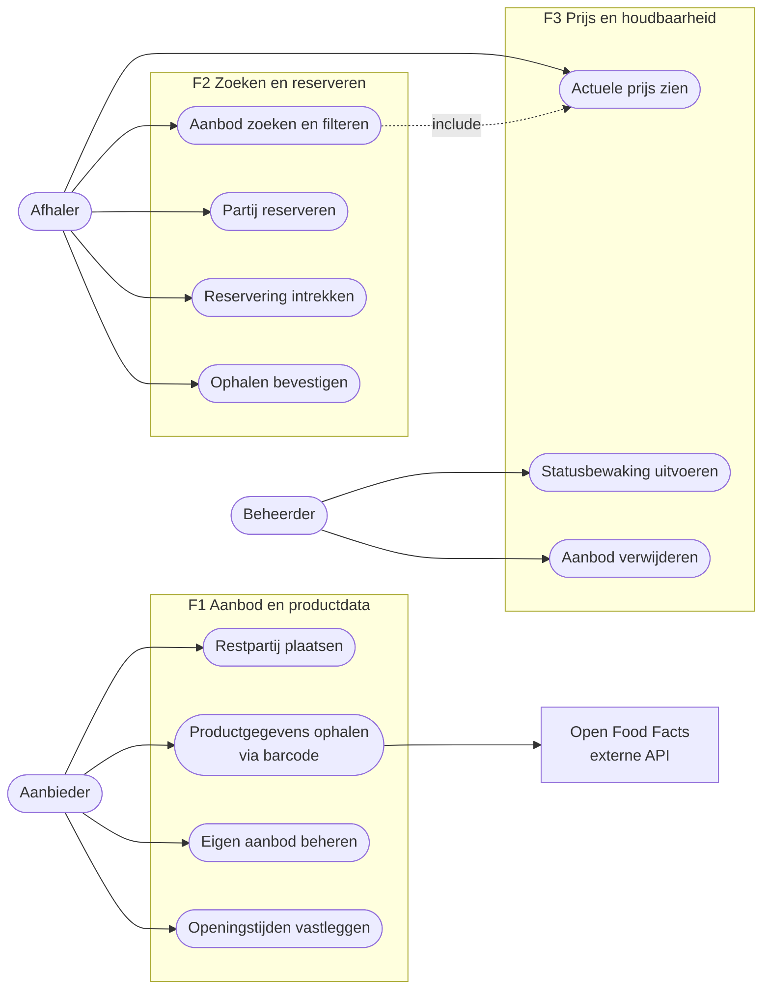

Het diagram toont de drie rollen en de use cases die de architectuur bepalen. De vlakken zijn de drie features, en daarmee ook de eigenaren: wie een use case zoekt, weet meteen bij wie hij moet zijn. Productgegevens ophalen via de barcode is een eigen use case van de aanbieder: hij haalt de gegevens op, controleert ze en plaatst daarna de partij. Eén use case hangt aan een andere vast: zoeken toont altijd de actuele prijs. Open Food Facts is de enige externe partij. Inloggen staat er niet in: het is een voorwaarde voor de afgeschermde use cases, geen doel van een gebruiker.

---

## 5. Acceptatiecriteria

<!-- ac-format: bullets -->

Elk criterium is één toetsbare uitspraak. Statuscodes zijn onderdeel van het criterium, zodat er een integratietest op te schrijven is.

### 5.1 US-01 — Restpartij plaatsen

- Een aanbieder met een geldig JWT en rol `SUPPLIER` kan een partij plaatsen; het antwoord is `201 Created` met de aangemaakte partij en status `LISTED`.
- Een verzoek zonder `bestBeforeAt` wordt geweigerd met `400 Bad Request` en de foutmelding benoemt het ontbrekende veld.
- Een `bestBeforeAt` in het verleden wordt geweigerd met `422 Unprocessable Entity`.
- Een afhaalvenster dat eindigt na `bestBeforeAt` wordt geweigerd met `422 Unprocessable Entity`.
- Wordt er geen afhaalvenster opgegeven, dan leidt de API het af uit de openingstijden van de aanbieder (US-10, §9.9).
- Wordt er geen afhaalvenster opgegeven en heeft de aanbieder geen openingstijden vastgelegd, dan wordt het verzoek geweigerd met `422 Unprocessable Entity`.
- Een `quantity` kleiner dan 1 wordt geweigerd met `422 Unprocessable Entity`.
- Een houdbaarheidsdatum die voor de productsoort onwaarschijnlijk ver weg ligt, wordt geweigerd met `422 Unprocessable Entity`; de foutmelding noemt de grens voor die soort (§9.10).
- Een allergeen dat niet op de EU-lijst van veertien allergenen staat (§9.8), wordt geweigerd met `400 Bad Request`: de waarde staat niet in de enum `Allergen` en is dus niet te deserialiseren.
- Een gebruiker met rol `COLLECTOR` die deze endpoint aanroept krijgt `403 Forbidden`.

### 5.2 US-02 — Productgegevens via barcode

- De barcode opzoeken is een aparte aanroep (`GET /products/lookup/{barcode}`). Het plaatsen van een partij roept Open Food Facts niet aan.
- Een bestaande barcode levert productnaam en allergenenlijst uit Open Food Facts, met `200 OK`.
- Een onbekende barcode levert `404 Not Found`.
- Als Open Food Facts niet binnen drie seconden antwoordt, levert de API `200 OK` met een leeg resultaat en een veld dat aangeeft dat handmatige invoer nodig is; het plaatsen van een partij blijft mogelijk.
- Elke uitgaande aanroep bevat een `User-Agent`-header met applicatienaam, versie en contactadres.
- Een allergeen-tag van Open Food Facts die niet naar de EU-lijst te vertalen is, wordt genegeerd en gelogd; dat leidt niet tot een fout.

### 5.3 US-03 — Eigen aanbod beheren

- Een aanbieder kan een eigen partij wijzigen; het antwoord is `200 OK` met de bijgewerkte partij.
- Een aanbieder die een partij van een andere aanbieder probeert te wijzigen krijgt `403 Forbidden`.
- Een aanbieder kan een eigen partij verwijderen; het antwoord is `204 No Content`. De partij krijgt status `REMOVED` en blijft in de database staan (§9.5).
- Alleen een partij met status `LISTED` kan worden verwijderd. Een partij met status `RESERVED`, `COLLECTED`, `EXPIRED` of `REMOVED` levert `409 Conflict`.
- Een verzoek op een niet-bestaande partij levert `404 Not Found`. Een partij met status `REMOVED` telt als niet-bestaand: `GET /products/{id}` levert dan ook `404 Not Found`.

### 5.4 US-04 — Aanbod zoeken en filteren

- Zonder filters levert de endpoint alleen partijen met status `LISTED` waarvan de houdbaarheidsdatum nog niet is verstreken, gesorteerd op oplopende resterende houdbaarheid. De service kijkt daarvoor zelf naar de tijd en wacht niet op de statusbewaking.
- Filteren op `category=FRESH` levert uitsluitend partijen van die soort.
- Filteren op `maxPrice` vergelijkt met de actuele afgeprijsde prijs, niet met de oorspronkelijke prijs. `maxPrice` is een bedrag in euro's, bijvoorbeeld `3.00` (§10.1).
- Filteren op `minShelfLifeHours` levert uitsluitend partijen met minimaal die resterende houdbaarheid.
- Meerdere filters tegelijk worden als EN-voorwaarde toegepast.
- Een onbekende waarde voor `category` levert `400 Bad Request` met de toegestane waarden in de foutmelding.
- De endpoint is zonder authenticatie te benaderen.
- Elke partij in het antwoord bevat de naam en de coördinaten van de aanbieder, zodat de app zelf de afstand kan berekenen (§18.1).

### 5.5 US-05 — Partij reserveren

- Een afhaler met rol `COLLECTOR` kan een partij met status `LISTED` reserveren; het antwoord is `201 Created` en de partij krijgt status `RESERVED`.
- Een partij die al status `RESERVED` heeft, kan niet opnieuw worden gereserveerd; het antwoord is `409 Conflict`.
- Een partij met status `EXPIRED` kan niet worden gereserveerd; het antwoord is `409 Conflict`. Dat geldt ook voor een partij die nog `LISTED` heet maar waarvan de houdbaarheidsdatum al is verstreken.
- Een partij die niet bestaat of status `REMOVED` heeft, kan niet worden gereserveerd; het antwoord is `404 Not Found` (voorstel B-32).
- Reserveren kan tot het einde van het afhaalvenster; daarna wordt het verzoek geweigerd met `422 Unprocessable Entity`.
- Een reservering is maximaal 24 uur geldig. Het antwoord bevat het moment waarop zij vervalt: 24 uur na het reserveren, of het einde van het afhaalvenster als dat eerder is.
- Reserveren twee afhalers dezelfde partij op hetzelfde moment, dan slaagt er precies één; de ander krijgt `409 Conflict`.
- Een reservering geldt voor de hele partij; een deel reserveren kan niet.
- Een gebruiker met rol `SUPPLIER` die deze endpoint aanroept krijgt `403 Forbidden`.
- De actuele prijs op het moment van reserveren wordt vastgelegd in de reservering en verandert daarna niet meer, ook niet als de partij daarna in een volgende staffel valt.

### 5.6 US-06 — Reservering intrekken

- Een afhaler kan een eigen reservering intrekken; het antwoord is `204 No Content` en de partij keert terug naar status `LISTED`.
- Een afhaler die de reservering van een ander probeert in te trekken krijgt `403 Forbidden`.
- Een reservering met status `COLLECTED` kan niet worden ingetrokken; het antwoord is `409 Conflict`.

### 5.7 US-07 — Actuele prijs zien

- De actuele prijs wordt berekend uit de oorspronkelijke prijs en het kortingspercentage van de staffel waarin de resterende houdbaarheid valt (§9.4).
- Op een staffelgrens geldt de hogere korting: bij precies 48 uur resterend is de korting op koelvers 10%.
- Het kortingspercentage is nooit hoger dan de hoogste staffel van de productsoort.
- De actuele prijs is nooit negatief en nooit hoger dan de oorspronkelijke prijs.
- De actuele prijs is een geheel aantal centen. Een restant van een cent valt weg: 349 cent met 60% korting wordt 139 cent (§9.4).
- Twee aanroepen op hetzelfde moment met dezelfde klok leveren dezelfde prijs.
- De oorspronkelijke prijs, het kortingspercentage en de actuele prijs staan in het antwoord van `GET /products` en `GET /products/{id}`. Er is geen aparte prijsendpoint.
- Een partij waarvan de houdbaarheidsdatum is verstreken levert geen prijs maar status `EXPIRED`; `GET /products/{id}` antwoordt in dat geval met `200 OK`.
- De berekening gebruikt een injecteerbare `Clock`, zodat de uitkomst in een test met een vaste tijd reproduceerbaar is.

### 5.8 US-08 — Automatische statusbewaking

- Een partij waarvan `bestBeforeAt` is verstreken, krijgt status `EXPIRED`.
- Een reservering die niet is opgehaald, vervalt zodra het afhaalvenster voorbij is of zodra zij 24 uur oud is, wat het eerst komt. De partij keert terug naar `LISTED`.
- Een gereserveerde partij waarvan ook de houdbaarheidsdatum is verstreken, eindigt in dezelfde run op `EXPIRED` en niet op `LISTED`.
- Een partij met status `COLLECTED` wordt door de statusbewaking niet gewijzigd.
- De statusbewaking is idempotent: twee keer draaien levert hetzelfde resultaat.
- De statusbewaking is via een beheerdersendpoint handmatig te starten, zodat het tijdens de demo te tonen is.

### 5.9 US-09 — Aanbod verwijderen als beheerder

- Een gebruiker met rol `ADMIN` kan elke partij verwijderen, ongeacht de aanbieder; het antwoord is `204 No Content` en de partij krijgt status `REMOVED`.
- Bij het verwijderen van een gereserveerde partij vervalt eerst de bijbehorende reservering; daarna krijgt de partij status `REMOVED`. Beide gebeuren in één transactie.
- Een partij met status `COLLECTED`, `EXPIRED` of `REMOVED` kan niet worden verwijderd; het antwoord is `409 Conflict`.
- Een gebruiker zonder rol `ADMIN` krijgt `403 Forbidden`.

**Beheeroverzicht (`GET /admin/products`).** Tot v2.2 had het beheeroverzicht geen eigen criteria. Het hoort bij de beheerder en staat daarom hier. De criteria volgen besluit B-26, dat is goedgekeurd.

- Een gebruiker met rol `ADMIN` krijgt alle partijen, ongeacht de aanbieder; het antwoord is `200 OK`.
- Zonder filter bevat het overzicht partijen in elke status behalve `REMOVED`.
- Met het filter `status` bevat het overzicht alleen partijen met de gevraagde status. Er mogen meer waarden tegelijk worden opgegeven. `status=REMOVED` toont de verwijderde partijen.
- Een onbekende waarde voor `status` levert `400 Bad Request` met de toegestane waarden in de foutmelding.
- Een gebruiker zonder rol `ADMIN` krijgt `403 Forbidden`.

### 5.10 US-10 — Openingstijden vastleggen

- Een aanbieder kan per weekdag één openings- en één sluitingstijd vastleggen; het antwoord is `200 OK` met de opgeslagen openingstijden.
- Een sluitingstijd die niet na de openingstijd ligt, wordt geweigerd met `422 Unprocessable Entity`.
- Een aanbieder die de openingstijden van een andere aanbieder probeert te wijzigen krijgt `403 Forbidden`.
- De openingstijden van een aanbieder zijn zonder authenticatie op te vragen.
- Het afgeleide afhaalvenster begint bij het plaatsen als de aanbieder op dat moment open is, en anders op het eerstvolgende openingsmoment.
- Het afgeleide afhaalvenster eindigt op `bestBeforeAt`, of op het laatste sluitingsmoment daarvoor als de aanbieder op `bestBeforeAt` gesloten is.
- Een dag zonder openingstijden telt als gesloten en wordt bij het afleiden overgeslagen.
- Is de aanbieder tussen het plaatsen en `bestBeforeAt` geen moment open, dan wordt het plaatsen van de partij geweigerd met `422 Unprocessable Entity`.

### 5.11 US-11 — Ophalen bevestigen

- Een afhaler kan het ophalen van een eigen reservering bevestigen; het antwoord is `200 OK`, de reservering en de partij krijgen status `COLLECTED` en het tijdstip wordt vastgelegd.
- Een afhaler die de reservering van een ander probeert te bevestigen krijgt `403 Forbidden`.
- Een reservering die al is opgehaald, ingetrokken of vervallen kan niet worden bevestigd; het antwoord is `409 Conflict`.
- Bevestigen buiten het afhaalvenster wordt geweigerd met `422 Unprocessable Entity`.

De aanbieder geeft de partij pas mee nadat de afhaler in de app heeft bevestigd. Dat is een afspraak in het proces en geen regel in de API. Wordt er niet bevestigd, dan gaat het ophalen dus niet door: de reservering vervalt aan het einde van het afhaalvenster en de partij komt weer beschikbaar (US-08).

---

## 6. Traceability matrix

| Story | Ontwerpcomponent | API / DB-artefact | Testcase | Eigenaar |
|-------|------------------|-------------------|----------|----------|
| US-01 | `ProductService`, `SurplusProduct` | `POST /api/v1/products`, tabel `surplus_products` | TC-01 | Eva |
| US-02 | `OpenFoodFactsClient`, `AllergenMapper` | `GET /api/v1/products/lookup/{barcode}` | TC-02 | Eva |
| US-03 | `ProductService`, `OwnershipGuard` | `PUT`/`DELETE /api/v1/products/{id}` | TC-03 | Eva |
| US-04 | `ProductSearchService`, `SearchCriteria` | `GET /api/v1/products` | TC-04 | Stefan |
| US-05 | `ReservationService`, `ReservationStateMachine` | `POST /api/v1/reservations`, tabel `reservations` | TC-05 | Stefan |
| US-06 | `ReservationService` | `DELETE /api/v1/reservations/{id}` | TC-06 | Stefan |
| US-07 | `PricingService`, `DiscountPolicy`, `DiscountTier` | Velden `originalPrice`, `discountPercentage` en `currentPrice` in `GET /api/v1/products` en `GET /api/v1/products/{id}` | TC-07 | Lonneke |
| US-08 | `ExpiryScheduler`, `PricingService` | `POST /api/v1/admin/maintenance/expire` | TC-08 | Lonneke |
| US-09 | `AdminProductService` | `DELETE /api/v1/admin/products/{id}`, `GET /api/v1/admin/products` | TC-09 | Lonneke |
| US-10 | `OpeningHours`, `PickupWindowCalculator` | `GET`/`PUT /api/v1/suppliers/{id}/opening-hours`, tabel `supplier_opening_hours` | TC-10 | Eva |
| US-11 | `ReservationService`, `ReservationStateMachine` | `POST /api/v1/reservations/{id}/collect` | TC-11 | Stefan |

US-07 heeft sinds v1.1 geen eigen endpoint meer. De logica blijft van Lonneke; de integratietest van TC-07 draait tegen `GET /api/v1/products/{id}`.

---

## 7. Definition of Done

Een story is af als:

- [ ] De implementatie is gemerged via een pull request met minimaal één review door een groepsgenoot.
- [ ] De unittesten voor de domeinlogica zijn groen, inclusief minimaal één edge case.
- [ ] Er is een integratietest op de endpoint via `testApplication`.
- [ ] Alle acceptatiecriteria zijn aantoonbaar gehaald.
- [ ] De publieke klassen en methoden hebben KDoc waar die toegevoegde waarde heeft (r.194).
- [ ] De code voldoet aan de Kotlin- en Ktor-naamgevingsconventies (r.192).
- [ ] De eigenaar kan de code, de keuzes en de testaanpak zelfstandig toelichten (r.367).
- [ ] Het gebruik van AI-tooling bij deze story staat in het AI-logboek.

---

## 8. Architectuur

De architectuurbeslissingen (ADR-01 tot en met ADR-07) staan niet in dit document, maar in de codebase: `docs/adr/`, één bestand per ADR. Een verwijzing als "ADR-07" in dit document gaat naar dat bestand. Het ADR-07 dat in W-13 is geschrapt, is een ander concept dat nooit in een versie heeft gestaan; het huidige ADR-07 gaat over bedragen in centen.

### 8.1 Context (C4 niveau 1)

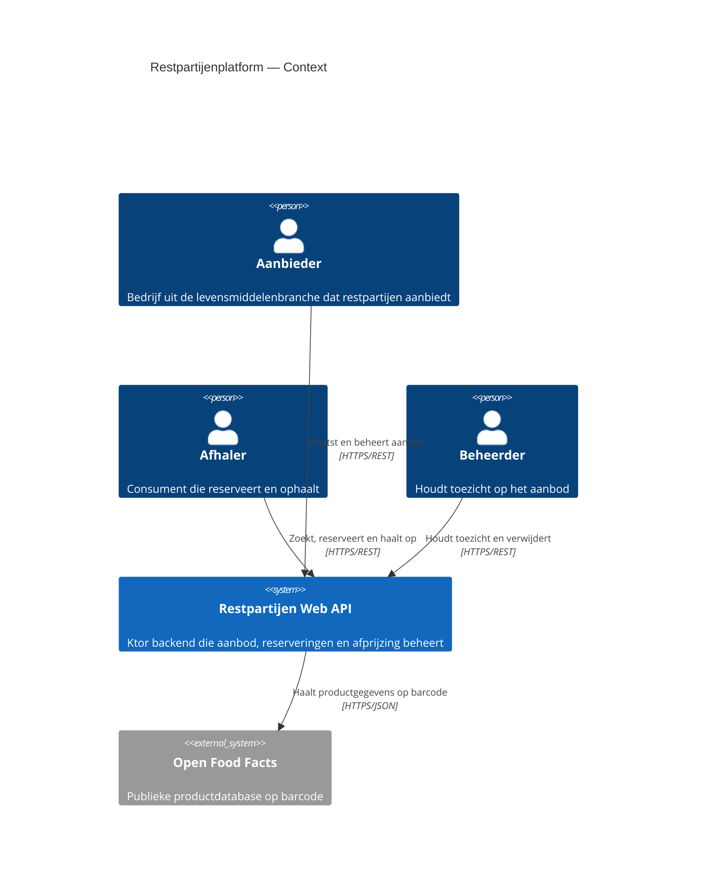

Dit is het systeem van buitenaf. Er zijn drie soorten gebruikers, elk met een eigen rol (§1.3), en één extern systeem. Alleen de API praat met Open Food Facts; een gebruiker doet dat nooit rechtstreeks. Valt Open Food Facts weg, dan blijft de API werken met handmatige invoer (§10.3).

### 8.2 Containers (C4 niveau 2)

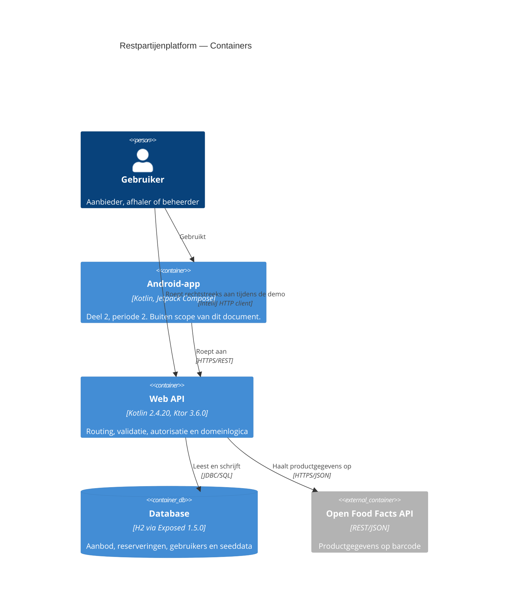

Eén niveau dieper bestaat het systeem uit twee containers: de Web API en de database. De Android-app volgt in periode 2 en staat erbij om te laten zien wie de API straks aanroept. Tot die tijd roepen we de API rechtstreeks aan met de HTTP client van IntelliJ, ook tijdens de demo. H2 draait ingebed in hetzelfde proces als de API, dus er is geen aparte databaseserver om te installeren. Alleen de API praat met de database en met Open Food Facts.

### 8.3 Packagestructuur

De packagestructuur volgt de featuregrenzen. Dat is een bewuste keuze: iedere student heeft een eigen package waarin de eigen klassen leven, waardoor merge-conflicten grotendeels verdwijnen en bij het assessment direct aanwijsbaar is welke code van wie is (r.69, r.193).

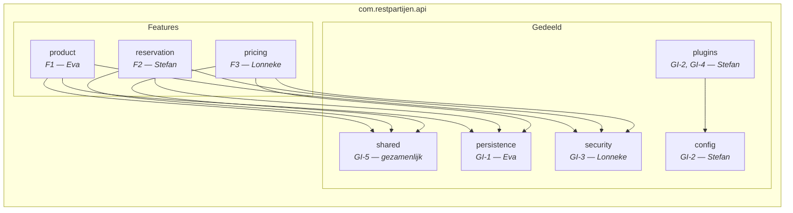

Een pijl betekent: deze package gebruikt die package. De featurepackages gebruiken alleen de gedeelde packages, nooit andersom en nooit elkaar. Wat de ene feature van de andere nodig heeft, loopt via een contract in `shared` (§12.1). Daardoor is een feature te bouwen en te testen zonder de code van een ander. Hoe dat in de praktijk werkt, staat in bijlage A.

Binnen elke featurepackage geldt dezelfde indeling: `model` (domeinklassen), `service` (domeinlogica), `repository` (persistentie), `routes` (Ktor-routing) en `dto` (request- en responsemodellen). Die herhaling is bewust: wie in één feature de weg kent, kent hem in alle drie.

In de repository staan de packages als mappen direct onder `../server/src`. De map `../server/src` hoort bij de package `com.restpartijen.api.product`, en zo verder. De mappen `com/restpartijen/api` ontbreken bewust: in een project met alleen Kotlin laat de Kotlin-conventie het gemeenschappelijke begin van de package weg uit de mappen (JetBrains s.r.o., z.j.-c). De package in de code blijft wel `com.restpartijen.api`.

### 8.4 Klassendiagram

Twee polymorfe hiërarchieën met elk een eigen eigenaar. Dat is de dragende ontwerpkeuze van dit project; de motivatie staat in ADR-02.

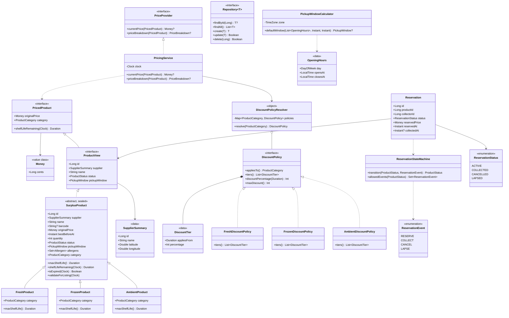

Het diagram toont de kernklassen van de drie features, niet alle klassen. Services, repositories en DTO's die geen OO-concept laten zien, staan alleen in de verdelingsmatrix (§11).

**Waar de abstractie zit** (r.165): `SurplusProduct` is een abstracte, `sealed` class. Wat voor elke soort gelijk is, staat in de basisklasse: de gedeelde velden, `shelfLifeRemaining()`, `isExpired()` en de controle bij het plaatsen, `validateForListing()`. Wat per soort verschilt, vullen de drie subklassen in: de property `category` en de function `maxShelfLife()`, de langste houdbaarheid die voor die soort nog geloofwaardig is (§9.10). Een `*` in het diagram betekent abstract. Tot v2.1 was `category()` een function; het contract `PricedProduct` maakt er een property van, en `SurplusProduct` volgt het contract (B-23). Het polymorfisme blijft gelijk: elke subklasse overschrijft de property met de eigen soort. Dat is ook het antwoord op de vraag waarom dit een abstracte class is en geen interface: er is gedeelde toestand en gedeelde implementatie. Omdat de class `sealed` is, controleert de compiler dat de factory elke soort afhandelt. `DiscountPolicy` is een interface met drie implementaties. Sinds v1.1 levert elke implementatie alleen de eigen staffels via `tiers()`; `discountPercentage()` en `maxDiscount()` staan als default implementatie in de interface zelf, zodat de opzoeklogica op één plek staat. Sinds v2.2 is een korting een heel percentage (`Int`), geen factor; daarom heet de function `discountPercentage()` en niet meer `discountFactor()` (ADR-07). `Repository<T>` is een generieke interface. Tot v2.2 had hij één `save()`; sinds v2.3 zijn dat `create()` en `update()`, zodat "niet gevonden" bij het bijwerken een eigen antwoord heeft (B-33). `DiscountPolicyResolver` is een object declaration (singleton). Daarmee zijn overerving, interfaces, abstracte classes, polymorfisme, generics en het singleton-patroon alle zes aanwijsbaar in het diagram. `PricedProduct`, `ProductView` en `PriceProvider` zijn contracten uit §12.1: de features zien elkaar alleen door deze interfaces. `Money` en `SupplierSummary` staan in `shared`, omdat ze in een contract voorkomen. `PriceProvider` geeft `null` terug als een partij verlopen is (B-18): geen prijs is een gewone toestand en geen fout, en de compiler dwingt elke aanroeper dat geval af te handelen.

`OpeningHours` en `PickupWindowCalculator` horen bij US-10 (§9.9). De calculator kent geen repository en geen HTTP: hij krijgt openingstijden en twee tijdstippen en geeft een afhaalvenster terug, of `null` als de aanbieder vóór `bestBeforeAt` niet meer open is.

**Hoe de klassen samenwerken.** `PricingService` kent alleen interfaces. Van een partij ziet hij `PricedProduct`, en de korting vraagt hij aan een `DiscountPolicy`. Welke policy dat is, bepaalt `DiscountPolicyResolver` aan de hand van de categorie. Een vierde productsoort betekent dus een subklasse en een policy erbij, zonder dat `PricingService` verandert. F2 ziet een partij alleen als `ProductView`, zonder setters. Elke statuswijziging rond een reservering gaat langs `ReservationStateMachine` (§9.5).

### 8.5 Sequence diagrams

#### SD-1 — Productgegevens opzoeken en restpartij plaatsen (US-01, US-02, US-10)

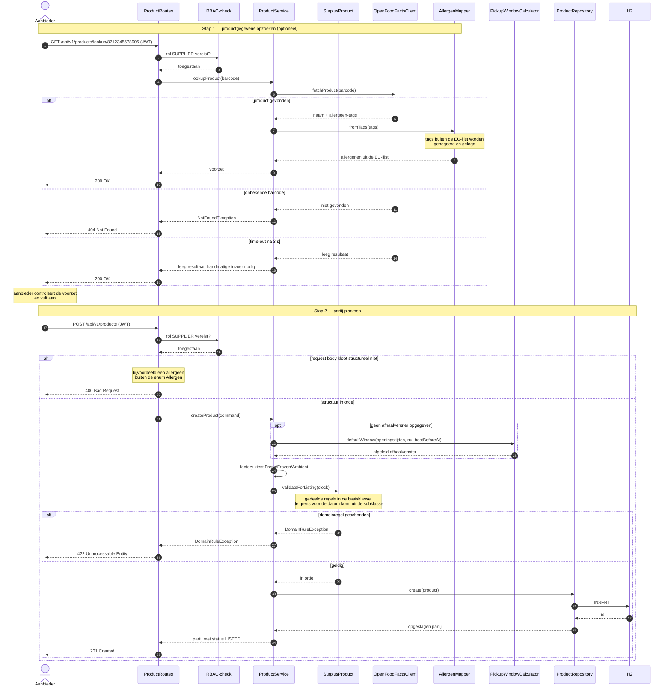

SD-1 heeft twee stappen. In stap 1 zoekt de aanbieder de productgegevens op via de barcode. De client haalt ze op; de `AllergenMapper` vertaalt de allergeen-tags naar de EU-lijst. Open Food Facts mag daarbij falen: na een time-out van drie seconden komt er een leeg antwoord terug en typt de aanbieder de gegevens zelf. De aanbieder controleert de voorzet altijd, want Open Food Facts wordt door vrijwilligers gevuld (§9.8). In stap 2 plaatst hij de partij. Die stap roept geen externe dienst aan en is daardoor te testen zonder Open Food Facts. Stap 2 laat ook de twee niveaus van validatie zien (§10.2). Een verzoek dat structureel niet klopt, komt niet verder dan de route en levert `400`. Een verzoek dat een domeinregel schendt, levert `422`. Is er geen afhaalvenster opgegeven, dan wordt het afgeleid uit de openingstijden. De factory kiest de subklasse die bij de categorie hoort, en de partij controleert daarna zichzelf met `validateForListing()`. Dat is de polymorfe aanroep van F1: de gedeelde regels staan in de basisklasse, en de grens voor de datum komt uit de subklasse (§9.10).

#### SD-2 — Zoeken en reserveren met autorisatie (US-04, US-05)

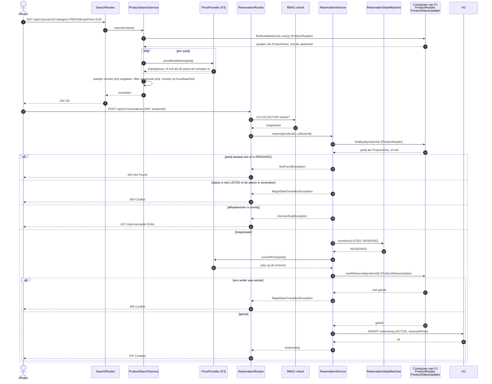

SD-2 volgt een afhaler van zoeken tot reserveren. F2 raakt de tabellen van F1 niet aan: lezen gaat via `ProductReader` en de status wijzigen via `ProductStatusUpdater` (bijlage A). Zoeken levert alleen partijen die `LISTED` zijn én nog houdbaar. De service kijkt daarvoor zelf naar de tijd en wacht niet op de statusbewaking. Per partij vraagt hij de prijsopbouw op. Die is om twee redenen nodig: het filter op maximumprijs werkt op de afgeprijsde prijs, en het antwoord toont de oorspronkelijke prijs, de korting en de actuele prijs (§5.7). Reserveren kan tot het einde van het afhaalvenster, en de statusmachine beslist of de overgang mag. Reserveren twee afhalers tegelijk, dan wint de eerste: de status gaat alleen naar `RESERVED` als hij op dat moment nog `LISTED` is, en de ander krijgt `409`. De prijs van dat moment gaat mee de reservering in. Beide schrijfacties vallen binnen één transactie (§9.6).

> **Opmerking v2.2 — voor Stefan.** Tot v2.1 riep zoeken `currentPrice()` aan. Dat levert alleen de actuele prijs, terwijl §5.7 in het antwoord van `GET /products` ook de oorspronkelijke prijs en het kortingspercentage eist. Zoeken gebruikt daarom `priceBreakdown()`; reserveren blijft `currentPrice()` gebruiken. Beide geven `null` als een partij verlopen is (B-18). Bij zoeken gebeurt dat zelden, want `findAvailable` levert alleen houdbare partijen. Maar tussen die twee aanroepen kan een partij net over de grens gaan. Laat zo'n partij dan weg uit het resultaat.

#### SD-3 — Productdetail met actuele prijs, polymorfe afprijzing (US-07)

Sinds v1.1 is er geen aparte prijsendpoint meer. De prijs wordt berekend op het moment dat een partij wordt opgevraagd. `ProductService` (F1) kent de afprijsregels niet en vraagt de prijs op via het contract `PriceProvider`, dat `PricingService` (F3) implementeert (§12.1, K-4).

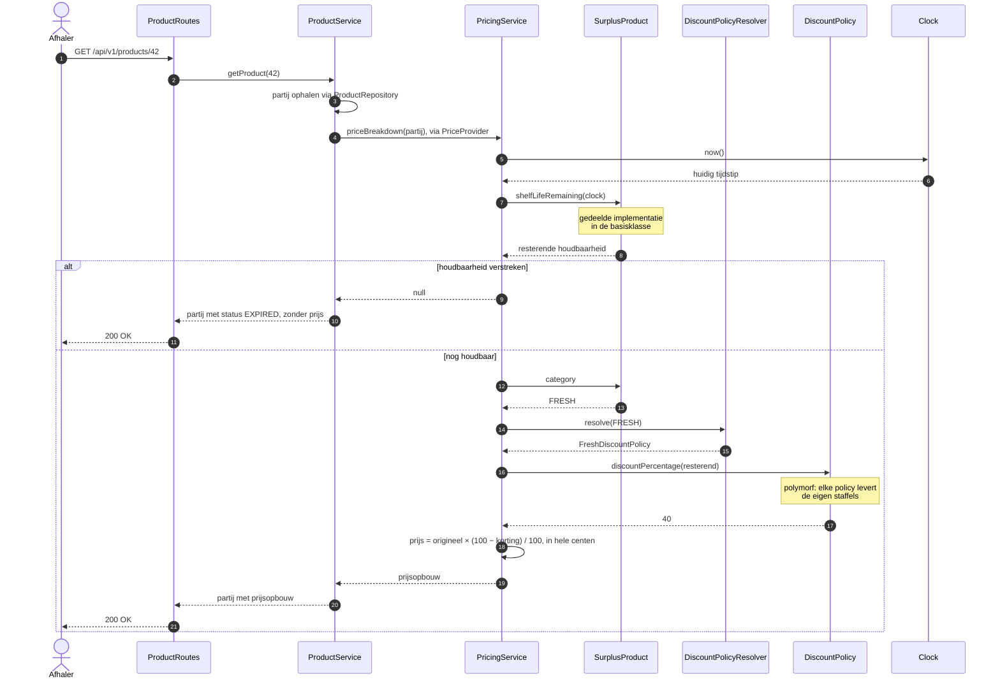

Het diagram bevat twee polymorfe aanroepen. `category` wordt beantwoord door de subklasse van het product, `discountPercentage()` door de policy van die productsoort. De prijs is een berekening met hele getallen; hoe de afronding werkt, staat in §9.4. `shelfLifeRemaining()` is voor elke soort gelijk en staat daarom in de basisklasse. `PricingService` weet in beide gevallen niet welke klasse hij aanroept. De tijd komt uit een `Clock` die van buiten wordt meegegeven, zodat een test haar kan vastzetten.

#### SD-4 — Automatische statusbewaking (US-08)

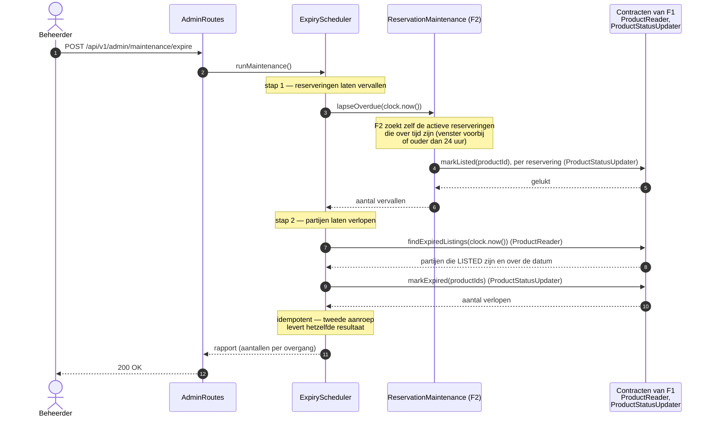

SD-4 toont de statusbewaking. De beheerder start haar hier handmatig, zodat zij tijdens de demo te tonen is. F3 beslist wat er moet gebeuren; F2 en F1 voeren het uit op hun eigen gegevens, via contracten (bijlage A). De volgorde van de twee stappen is een besluit. Eerst vervallen de reserveringen die over tijd zijn: het afhaalvenster is voorbij, of de reservering is ouder dan 24 uur. Dat is één aanroep, `lapseOverdue`. F2 bepaalt zelf welke reserveringen over tijd zijn en voert het vervallen uit via de statusmachine; de partij komt dan weer vrij (§9.5). Tot v2.1 tekende dit diagram twee aanroepen, een om de reserveringen op te vragen en een om ze te laten vervallen. Dat kan niet via een contract: een `Reservation` is een klasse van F2 en staat niet in `shared`. Het contract geeft daarom alleen een aantal terug. Daarna verlopen de partijen waarvan de datum is verstreken. Andersom zou een verlopen partij door de tweede stap weer op `LISTED` komen. Het antwoord is een rapport met de aantallen per overgang. Een tweede aanroep direct erna verandert niets meer.

### 8.6 Kwaliteitsscenario's

- **Performance.** Twintig gelijktijdige aanroepen op `GET /api/v1/products` over de volledige seeddata leveren een p95-responstijd onder 300 ms. De drempel is bewust bescheiden: de applicatie draait lokaal op één laptop (r.72), en een strenger getal zou geen betekenis hebben.
- **Beschikbaarheid.** Als Open Food Facts niet binnen drie seconden antwoordt, blijft het plaatsen van een partij mogelijk met handmatig ingevoerde gegevens.
- **Security.** Een anonieme aanroep op `POST /api/v1/products` levert `401 Unauthorized`; een aanroep met een geldig token maar de verkeerde rol levert `403 Forbidden`.

---

## 9. Datamodel en persistentie

### 9.1 ERD

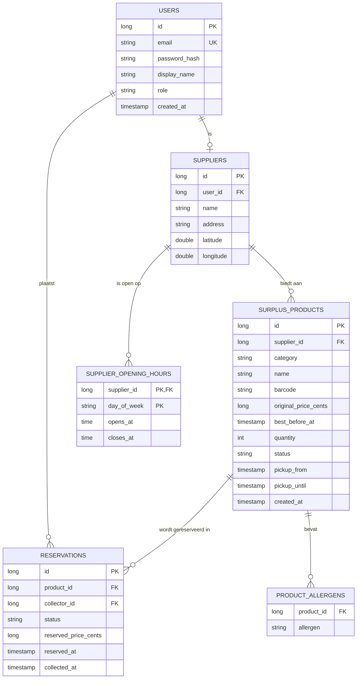

Het ERD heeft zes tabellen. Een account (`USERS`) kan bij een aanbieder horen; alleen dan is er een rij in `SUPPLIERS`. Een aanbieder heeft partijen en openingstijden. De drie productsoorten staan samen in één tabel met de kolom `category` (§9.3). Allergenen staan in een eigen tabel, omdat een partij er nul tot veertien kan hebben. Een reservering verwijst naar één afhaler en één partij, geldt voor die hele partij, en bewaart de prijs van het moment van reserveren. Bedragen staan als hele centen in een `long`-kolom; de naam eindigt daarom op `_cents` (ADR-07).

### 9.2 Entiteiten

| Entiteit | Omschrijving | Persoonsgegevens? | Eigenaar |
|----------|--------------|-------------------|----------|
| `USERS` | Account met rol en inloggegevens | Ja — e-mail, naam | GI-3, Lonneke |
| `SUPPLIERS` | Bedrijf uit de levensmiddelenbranche, gekoppeld aan een account | Ja — adres | F1, Eva |
| `SUPPLIER_OPENING_HOURS` | Openingstijden van een aanbieder, één regel per geopende weekdag | Nee — bedrijfsgegeven | F1, Eva |
| `SURPLUS_PRODUCTS` | Aangeboden restpartij | Nee | F1, Eva |
| `RESERVATIONS` | Reservering van een partij door een afhaler | Indirect — via `collector_id` | F2, Stefan |
| `PRODUCT_ALLERGENS` | Allergenen per partij | Nee | F1, Eva |

### 9.3 Vertaling van het objectmodel naar het relationele model

De drie productsoorten delen alle velden en verschillen alleen in gedrag. Daarom wordt **single table inheritance** toegepast: één tabel `SURPLUS_PRODUCTS` met een discriminatorkolom `category`. Bij het lezen kiest een factory op basis van die kolom de juiste Kotlin-klasse.

Deze keuze is bewust en is bij het assessment te verantwoorden (r.304):

- **Waarom niet één tabel per subklasse.** Dat zou drie tabellen met identieke kolommen opleveren en elke zoekopdracht over alle soorten in een UNION veranderen. De subklassen verschillen in gedrag, niet in gegevens.
- **Prijs van deze keuze.** Zou een productsoort in de toekomst een eigen veld krijgen — bijvoorbeeld een vriestemperatuur — dan staat die kolom leeg bij de andere twee soorten.

Een `Money`-waarde wordt opgeslagen als een geheel aantal centen in een `BIGINT`-kolom, de SQL-tegenhanger van een Kotlin-`Long`. Tot v2.1 was dat `DECIMAL`. Het doel is hetzelfde gebleven: geen `DOUBLE`, zodat er geen afrondingsfouten in prijsberekeningen ontstaan. Maar een `Long` bestaat op elk platform, en `BigDecimal` alleen op de JVM (ADR-07). Omdat `Money` een `value class` is, is het tijdens het draaien gewoon een `Long`; de omzetting tussen kolom en waardetype is één regel in de repository.

### 9.4 Afprijsstaffels per productsoort

Dit is de domeinlogica die verder gaat dan CRUD (r.374). De korting hangt af van de resterende houdbaarheid: de tijd tussen nu en `bestBeforeAt`. Zodra die onder een grens zakt, geldt de volgende staffel. De prijs is `originalPrice × (100 − korting) / 100`, in hele centen; de korting is een heel percentage (ADR-07).

| Soort | Resterende houdbaarheid | Korting |
|-------|-------------------------|---------|
| `FRESH` | meer dan 48 uur | 0% |
| | 48 uur of minder | 10% |
| | 24 uur of minder | 40% |
| | 12 uur of minder | 60% |
| `FROZEN` | meer dan 7 dagen | 0% |
| | 7 dagen of minder | 15% |
| | 24 uur of minder | 40% |
| `AMBIENT` | meer dan 14 dagen | 0% |
| | 14 dagen of minder | 15% |
| | 7 dagen of minder | 40% |

Drie regels maken de tabel ondubbelzinnig:

1. **De grens hoort bij de hogere korting.** Bij precies 48 uur resterend geldt voor koelvers al 10%; één seconde eerder nog 0%.
2. **Verstreken is verstreken.** Is de resterende houdbaarheid nul of negatief, dan is de partij `EXPIRED` en wordt er geen prijs berekend.
3. **De prijs bij het reserveren telt.** De actuele prijs op het moment van reserveren wordt vastgelegd in de reservering (`reserved_price_cents`) en verandert daarna niet meer. Zonder deze regel is niet te zeggen wat een afhaler betaalt als er tussen reserveren en ophalen een staffelgrens ligt. De profgroep heeft deze regel op 19 september 2026 vastgesteld.

**Afronding.** De uitkomst van de formule is niet altijd een hele cent. Een partij van 349 cent met 60% korting kost 349 × 40 / 100 = 139,6 cent. Kotlin deelt twee gehele getallen door alles achter de komma weg te laten. Bij een positief bedrag is dat afronden naar beneden, en dat houden we aan (B-24). De afhaler betaalt hier dus 139 cent. Het verschil is hoogstens één cent, en altijd in het voordeel van de afhaler. Dat past bij het doel van het platform. De regel voldoet aan §5.7: de prijs is nooit negatief en nooit hoger dan de oorspronkelijke prijs.

> **Opmerking v2.2 — voor Lonneke en Stefan.** Eva heeft de afrondingsregel vastgelegd; bevestig haar bij de review van v2.2. Twee dingen om op te letten. Eerst vermenigvuldigen, dan delen: wie eerst `(100 − korting) / 100` uitrekent, krijgt met gehele getallen altijd 0. Die fout compileert en valt pas in een test op. En de verwachte waarde in de testen volgt uit deze regel: 349 cent met 60% korting wordt 139 cent, niet 140. Deze afronding is een andere dan die bij het omrekenen van euro's naar centen in de API (§10.1). Die twee moeten niet door elkaar lopen.

De staffels verschillen per soort in tijdshorizon en in diepte. Koelvers begint pas twee dagen voor de datum en zakt dan in drie stappen naar 60%. Diepvries begint een week vooruit met een kleine stap en springt op de laatste dag. Houdbaar begint het vroegst, twee weken vooruit, en bereikt de hoogste staffel al een week voor de datum. Omdat de berekening alleen van de tijd afhangt, verandert de uitkomst zonder dat er iets in de database wijzigt — en is zij met een vaste `Clock` volledig reproduceerbaar te testen.

De grenzen en percentages zijn een keuze van de profgroep en geen gegeven uit de casusbeschrijving. De motivatie voor staffels in plaats van de doorlopende curves uit v1.0 staat in ADR-06.

### 9.5 Statusmachine

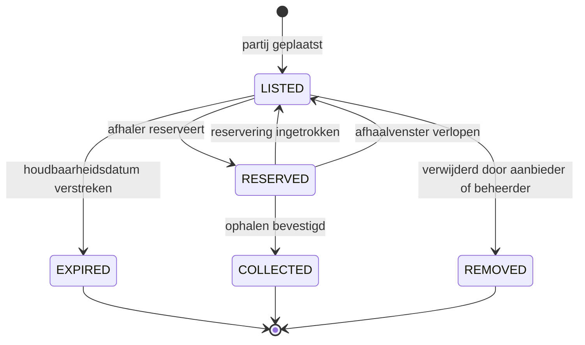

Het diagram toont de status van een partij (`ProductStatus`). `COLLECTED`, `EXPIRED` en `REMOVED` zijn eindtoestanden: daarna verandert een partij niet meer.

**Waarom verwijderen een status is (B-19).** Tot v2.1 verdween een verwijderde partij uit de tabel. Dat botst met het ERD: een reservering verwijst met een foreign key naar de partij (§9.1). Een partij met een oude, ingetrokken reservering is dan niet te verwijderen zonder die reservering mee te nemen, en dan is de geschiedenis weg. Met de eindstatus `REMOVED` blijft alles bewaard. Voor de publieke API bestaat een verwijderde partij niet meer: zoeken toont haar niet, `GET /products/{id}` levert `404`, en reserveren ook (voorstel B-32). Alleen een partij met status `LISTED` kan worden verwijderd. De beheerder die een gereserveerde partij verwijdert, laat eerst de reservering vervallen via `ReservationMaintenance`. De partij komt daarmee terug op `LISTED`, en gaat daarna naar `REMOVED`. Beide stappen vallen in één transactie (GI-1, besluit 1.4).

> **Opmerking v2.2 — voor Stefan: reserveren van een verwijderde partij levert `404` (B-32).** Tot nu toe volgde hier `409`, omdat een verwijderde partij niet `LISTED` is. Het voorstel is `404`. Drie redenen. Eén: zacht verwijderen, met een status in plaats van een rij die verdwijnt, is gewoonlijk een interne boekhouding; naar buiten doet de API alsof de partij weg is. Twee: RFC 9110 past daarbij. `404` betekent dat de server de bron niet vindt, of niet wil prijsgeven dat zij bestaat; `409` gaat over een botsing met de huidige toestand van een bron die er voor de gebruiker nog is (Fielding et al., 2022, §15.5.5 en §15.5.10). `410 Gone` is preciezer, maar komt minder vaak voor, vraagt een zevende exceptie en laat zien dat de partij ooit bestond (§15.5.11). Drie: `GET /products/{id}` levert al `404`. Zo krijgt de app op dezelfde vraag, bestaat deze partij, overal hetzelfde antwoord. In de code controleert de service `REMOVED` vóór de controle op `LISTED`, en gooit dan een `NotFoundException`. Een alternatief is dat `findById` zelf `null` geeft bij `REMOVED`, zodat elke gebruiker het vanzelf goed doet. Dat verandert wel de belofte van het contract en is dus een aparte keuze. Voeg bij de tests van US-05 een test toe voor dit geval.

De overgangen `RESERVED → LISTED` bij een verlopen venster en `LISTED → EXPIRED` bij een verstreken datum zijn de twee automatische overgangen. Die worden niet door een gebruiker aangeroepen maar door de statusbewaking (§8.5, SD-4). Daar wordt de business logic zichtbaar. Een gereserveerde partij waarvan de datum verstrijkt, komt in dezelfde run eerst vrij en verloopt daarna (SD-4).

Een reservering heeft een eigen, kleinere status (`ReservationStatus`). Die bewaart hoe de reservering is afgelopen, ook nadat de partij weer vrij is gekomen.

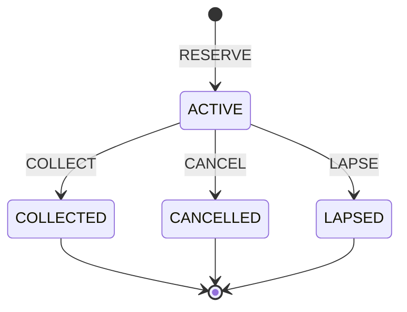

De twee statussen veranderen altijd samen, in één transactie. `ReservationStateMachine` bepaalt of een gebeurtenis (`ReservationEvent`) bij de huidige status van de partij is toegestaan:

| Gebeurtenis | Partij (`ProductStatus`) | Reservering (`ReservationStatus`) | Wie |
|-------------|--------------------------|-----------------------------------|-----|
| `RESERVE` | `LISTED` → `RESERVED` | nieuw: `ACTIVE` | Afhaler |
| `COLLECT` | `RESERVED` → `COLLECTED` | `ACTIVE` → `COLLECTED` | Afhaler |
| `CANCEL` | `RESERVED` → `LISTED` | `ACTIVE` → `CANCELLED` | Afhaler |
| `LAPSE` | `RESERVED` → `LISTED` | `ACTIVE` → `LAPSED` | Statusbewaking |

Elke andere combinatie levert een `IllegalStateTransitionException` en daarmee `409 Conflict` (§10.2). Verlopen is geen gebeurtenis van een reservering: de statusbewaking zet een partij met status `LISTED` op `EXPIRED` zodra de datum is verstreken.

Een reservering is maximaal 24 uur geldig. `LAPSE` volgt dus als het afhaalvenster voorbij is of als de reservering 24 uur oud is, wat het eerst komt. Zonder die grens houdt een reservering van dagen vooruit een partij vast tot vlak voor de datum. Komt de afhaler dan niet, dan is de partij alsnog verspild, en dat is precies wat het platform wil voorkomen. De 24 uur zijn een keuze van de profgroep (19 september 2026). Welke reserveringen over tijd zijn, bepaalt F2 achter het contract `ReservationMaintenance` (§12.1, K-5).

### 9.6 Opslagkeuzes

| Keuze | Besluit | Motivatie |
|-------|---------|-----------|
| Database | H2 2.x | Draait in het geheugen of op bestand, vereist geen installatie bij de assessor, wordt in de officiële Exposed-voorbeelden gebruikt |
| ORM | Exposed 1.5.0, DSL | De versie is voorgeschreven (§3.2). De opzet volgt de Ktor-handleiding voor database-integratie (JetBrains s.r.o., z.j.-f); broncode en voorbeelden staan in de Exposed-repository (JetBrains, z.j.). DSL houdt de SQL zichtbaar, wat helpt bij de assessmentvraag over de vertaling tussen OO en het relationele model |
| Schema | Aangemaakt bij het opstarten via `SchemaUtils.create` | Geen migratietooling nodig voor een project zonder productieomgeving |
| Transacties | Per service-aanroep, niet per repository-aanroep | Een reservering wijzigt twee tabellen en moet in één transactie slagen of falen |

### 9.7 Seeddata

De seeddata wordt bij het opstarten geladen als de database leeg is (r.84, r.198):

- Drie aanbieders: een supermarkt, een bakker en een groothandel, elk met een eigen locatie en eigen openingstijden.
- Per aanbieder minimaal vijf partijen. De supermarkt en de groothandel bieden alle drie de productsoorten aan; de bakker biedt vers en houdbaar aan.
- Houdbaarheidsdatums gespreid van enkele uren tot enkele weken, zodat elke staffel van elke productsoort in de demo zichtbaar is.
- De houdbaarheidsdatums worden bij het opstarten berekend ten opzichte van de klok ("nu plus zes uur") en staan niet als vaste datum in de seeddata. Een vaste datum is op de dag van het assessment verlopen.
- Minstens één partij in elke status: `LISTED`, `RESERVED`, `COLLECTED`, `EXPIRED` en `REMOVED` (B-31).
- Zes gebruikersaccounts: drie aanbieders, twee afhalers en één beheerder.

De spreiding van houdbaarheidsdatums is geen detail. Zonder een partij in elke staffel is de afprijslogica tijdens de demo niet te tonen. `SeedData` schrijft daarbij rechtstreeks in alle tabellen; dat is een bewuste uitzondering op de contractregel (§12.1).

**Waarom een verwijderde partij in de seeddata (B-31).** Demo- en testdata dekken gewoonlijk elke toestand die je wilt tonen of testen: minstens één voorbeeld per enumwaarde. Voor de vier andere statussen doen we dat al; `REMOVED` is er in v2.2 bij gekomen. Zonder zo'n partij is het filter `status=REMOVED` in het beheeroverzicht (§5.9) niet te tonen, of moet de beheerder tijdens de demo eerst iets verwijderen. Dat kost tijd en kan misgaan. Het voorstel is goedgekeurd.

### 9.8 Allergenen

De toegestane allergenen zijn de veertien groepen uit bijlage II van Verordening (EU) nr. 1169/2011 (2011). Over deze veertien moet een levensmiddelenbedrijf zijn klanten altijd informeren, bij verpakte en bij onverpakte producten (Nederlandse Voedsel- en Warenautoriteit [NVWA], z.j.). De lijst staat als enum `Allergen` in `shared` (GI-5).

| # | Allergeen | Enumwaarde | Tag bij Open Food Facts |
|---|-----------|------------|-------------------------|
| 1 | Glutenbevattende granen | `CEREALS_CONTAINING_GLUTEN` | `en:gluten` |
| 2 | Schaaldieren | `CRUSTACEANS` | `en:crustaceans` |
| 3 | Ei | `EGGS` | `en:eggs` |
| 4 | Vis | `FISH` | `en:fish` |
| 5 | Pinda | `PEANUTS` | `en:peanuts` |
| 6 | Soja | `SOYBEANS` | `en:soybeans` |
| 7 | Melk, inclusief lactose | `MILK` | `en:milk` |
| 8 | Noten | `NUTS` | `en:nuts` |
| 9 | Selderij | `CELERY` | `en:celery` |
| 10 | Mosterd | `MUSTARD` | `en:mustard` |
| 11 | Sesamzaad | `SESAME` | `en:sesame-seeds` |
| 12 | Zwaveldioxide en sulfiet | `SULPHITES` | `en:sulphur-dioxide-and-sulphites` |
| 13 | Lupine | `LUPIN` | `en:lupin` |
| 14 | Weekdieren | `MOLLUSCS` | `en:molluscs` |

Het zijn veertien groepen. Twee daarvan, glutenbevattende granen en noten, noemen in de verordening afzonderlijke soorten, zoals tarwe en hazelnoot. De API modelleert op groepsniveau; de afzonderlijke soorten vallen buiten scope.

Een wettelijk vastgelegde lijst heeft twee voordelen boven een eigen lijst. De validatie is een gesloten vraag: een waarde staat in de enum of niet. En de keuze is te verdedigen zonder eigen afweging over welke allergenen ertoe doen.

Open Food Facts levert allergenen als tags, bijvoorbeeld `en:milk`. De `OpenFoodFactsClient` haalt ze op; de `AllergenMapper` vertaalt ze naar de enum. Een tag die niet te vertalen is, wordt genegeerd en gelogd. Dat komt vaak voor: Open Food Facts kent ook allergenen buiten de EU-lijst, zoals `en:pork` en `en:apple`, en bevat vrije tekst die niet is herkend (Open Food Facts, z.j.-b). De tags in de tabel zijn de genormaliseerde namen uit die lijst; bij de realisatie controleren we ze met één echte aanroep. De mapper is bewust een eigen klasse en geen onderdeel van de client. Vertalen is een pure functie: dezelfde tags leveren altijd dezelfde allergenen. Daardoor is zij te testen zonder netwerk en zonder Open Food Facts na te bootsen. Open Food Facts is een database die door vrijwilligers wordt gevuld. Wat eruit komt is daarom een voorzet die de aanbieder controleert, geen garantie.

### 9.9 Openingstijden en afhaalvenster

Een aanbieder legt per weekdag één openings- en één sluitingstijd vast (US-10). Een dag zonder regel is een gesloten dag. Wordt een partij geplaatst zonder afhaalvenster, dan berekent `PickupWindowCalculator` het venster. Het begint bij het plaatsen als de aanbieder dan open is, en anders op het eerstvolgende openingsmoment. Het eindigt op `bestBeforeAt`, of op het laatste sluitingsmoment daarvoor als de aanbieder op dat tijdstip gesloten is. Een koelverse partij die vandaag om 15.00 uur verloopt bij een winkel die tot 18.00 uur open is, is dus tot 15.00 uur op te halen. De uitkomst wordt als `pickup_from` en `pickup_until` bij de partij opgeslagen. Reserveren en de statusbewaking werken daardoor met hetzelfde afhaalvenster als in v1.0 en hoeven de openingstijden niet te kennen.

De randgevallen liggen vast:

- Een aanbieder kan per partij een afwijkend afhaalvenster opgeven; dat gaat voor.
- Is de aanbieder tussen het plaatsen en `bestBeforeAt` geen moment open, dan is de partij niet op te halen en wordt het plaatsen geweigerd met `422`.
- Een latere wijziging van de openingstijden werkt niet terug op bestaande partijen.
- Er is één tijdvak per dag. Een middagsluiting valt buiten scope.
- Openingstijden zijn lokale tijden. Het platform rekent met één vaste tijdzone, `Europe/Amsterdam`, en zet ze met kotlinx-datetime om naar een `Instant`. Die library is al een afhankelijkheid van `exposed-kotlin-datetime`, dus er komt geen nieuwe library bij om te verdedigen.

Dat laatste punt is de verborgen prijs van deze story. Tot v1.0 kende het ontwerp alleen tijdstippen, en daar komt geen tijdzone aan te pas. Openingstijden brengen weekdagen, lokale tijd en zomertijd het domein in. De logica blijft beheersbaar doordat zij in één klasse zit die een pure functie is: dezelfde openingstijden, hetzelfde plaatsingsmoment en dezelfde houdbaarheidsdatum leveren altijd hetzelfde venster.

### 9.10 Plausibiliteit van de houdbaarheidsdatum per productsoort

Bij het plaatsen controleert een partij zichzelf, met `SurplusProduct.validateForListing()` (§8.4). Drie regels gelden voor elke soort: de datum ligt in de toekomst, het afhaalvenster eindigt niet na de datum, en het aantal is minstens 1. De vierde regel verschilt per soort. De resterende houdbaarheid mag niet langer zijn dan voor die soort geloofwaardig is.

| Soort | Langste geloofwaardige houdbaarheid bij het plaatsen |
|-------|------------------------------------------------------|
| `FRESH` | 14 dagen |
| `FROZEN` | 1095 dagen (3 jaar) |
| `AMBIENT` | 1825 dagen (5 jaar) |

De regel vangt typefouten en een verkeerd gekozen productsoort. Koelvers met een datum over een jaar is bijna zeker diepvries, of een tikfout. Voor vers is de grens 14 dagen: koelverse restpartijen zitten dicht bij hun datum. Voor diepvries en houdbaar zijn de grenzen ruim, want de regel moet fouten vangen en geen echte producten weigeren. Het zijn keuzes van de profgroep (19 september 2026), net als de staffels in §9.4. Precies op de grens is toegestaan; één dag erover levert `422`, met de grens in de foutmelding.

Dit is ook de reden dat de drie productsoorten subklassen zijn en geen veld met een enum. Elke soort brengt eigen gedrag mee, en `ProductService` roept dat aan zonder de soort te kennen.

---

## 10. API en integratie

### 10.1 Endpoints

Basis-URL: `/api/v1`. De kolom "Rol" geeft de rol die de endpoint mag aanroepen; `—` betekent openbaar. Het overzicht per rol staat in §1.3.

| Endpoint | Methode | Rol | Omschrijving | Feature |
|----------|---------|-----|--------------|---------|
| `/auth/register` | POST | — | Account aanmaken; maakt altijd een `COLLECTOR`-account | GI-3 |
| `/auth/login` | POST | — | Inloggen; levert het JWT, de rol en bij een aanbieder het `supplierId` | GI-3 |
| `/products` | GET | — | Aanbod zoeken en filteren, met de actuele prijs per partij | F2 |
| `/products/{id}` | GET | — | Detail van één partij, met prijsopbouw | F1 |
| `/products` | POST | `SUPPLIER` | Partij plaatsen | F1 |
| `/products/{id}` | PUT | `SUPPLIER` | Eigen partij wijzigen | F1 |
| `/products/{id}` | DELETE | `SUPPLIER` | Eigen partij verwijderen | F1 |
| `/products/lookup/{barcode}` | GET | `SUPPLIER` | Productgegevens via Open Food Facts | F1 |
| `/suppliers/{id}/products` | GET | — | Aanbod van één aanbieder | F1 |
| `/suppliers/{id}/opening-hours` | GET | — | Openingstijden van één aanbieder | F1 |
| `/suppliers/{id}/opening-hours` | PUT | `SUPPLIER` | Eigen openingstijden vastleggen | F1 |
| `/reservations` | POST | `COLLECTOR` | Partij reserveren | F2 |
| `/reservations` | GET | `COLLECTOR` | Eigen reserveringen | F2 |
| `/reservations/{id}` | DELETE | `COLLECTOR` | Reservering intrekken | F2 |
| `/reservations/{id}/collect` | POST | `COLLECTOR` | Ophalen bevestigen | F2 |
| `/admin/products` | GET | `ADMIN` | Beheeroverzicht van al het aanbod; standaard zonder `REMOVED`, met een optioneel filter `status` (B-26) | F3 |
| `/admin/products/{id}` | DELETE | `ADMIN` | Partij verwijderen als beheerder | F3 |
| `/admin/maintenance/expire` | POST | `ADMIN` | Statusbewaking handmatig starten | F3 |

Alle vier de CRUD-soorten zijn hiermee gedekt (r.202): POST op `/products`, GET op `/products`, PUT op `/products/{id}` en DELETE op `/products/{id}`.

In v1.1 is `/products/{id}/pricing` vervallen. De prijs hoort bij de partij en staat daarom in het antwoord van de partij zelf, als drie velden: `originalPrice`, `discountPercentage` en `currentPrice`. Dat scheelt de app in periode 2 een aanroep per getoonde partij. De afprijslogica blijft van F3; F1 en F2 vragen de prijs op via `PriceProvider` (§12.1).

**Bedragen in de API (B-25).** Intern rekenen we in hele centen (`Money`, ADR-07). De API stuurt en ontvangt bedragen in euro's, bijvoorbeeld `3.49`. Dat geldt voor de request body van `POST /products` en `PUT /products/{id}`, voor het filter `maxPrice` en voor elk antwoord met een prijs. Euro's zijn voor een mens leesbaar in de demo, en de app hoeft niet om te rekenen voor het tonen. De omrekening tussen euro's en centen staat op één plek, in de DTO-laag of in `Money` zelf.

> **Opmerking v2.2 — voor Lonneke en Stefan.** Een JSON-getal als `3.49` wordt in Kotlin een `Double`, en een `Double` kan 3,49 niet exact opslaan. Vermenigvuldig je met 100, dan krijg je iets als 348,99999. Kap je dat af, dan wordt de prijs 348 cent in plaats van 349. Bij het omrekenen van euro's naar centen ronden we daarom af naar de dichtstbijzijnde cent, nooit afkappen. Dat is een andere regel dan de afronding van de korting, die altijd naar beneden gaat (§9.4). Wie een bedrag uit een request of een queryparameter leest, gebruikt de ene gedeelde omrekening en schrijft geen eigen.

### 10.2 Validatie en foutafhandeling

Validatie gebeurt op twee niveaus. `RequestValidation` controleert de structuur van de request body — verplichte velden, typen, bereiken. De servicelaag controleert de domeinregels: een datum in het verleden, een afhaalvenster dat na de houdbaarheidsdatum eindigt, een statusovergang die niet mag. Een waarde die niet in een enum voorkomt, is een structurele fout: het verzoek is dan niet te deserialiseren. Een onbekende `category` en een allergeen buiten de EU-lijst leveren dus allebei `400`. De regels die bij een partij zelf horen, controleert de partij: `SurplusProduct.validateForListing()` (§9.10).

De domeinexcepties vormen één hiërarchie in `shared` (GI-5), zodat `StatusPages` ze centraal omzet:

| Exception | Statuscode | Wanneer |
|-----------|------------|---------|
| `ValidationException` | 400 | Structurele fout in het verzoek |
| `DomainRuleException` | 422 | Verzoek is goed gevormd maar schendt een domeinregel |
| `NotFoundException` | 404 | Opgevraagde bron bestaat niet |
| `UnauthorizedException` | 401 | Geen of ongeldig token |
| `ForbiddenException` | 403 | Geldig token, verkeerde rol of geen eigenaar |
| `IllegalStateTransitionException` | 409 | Statusovergang niet toegestaan |

`DomainException` is een `abstract` class en geen `sealed` class (B-22). `StatusPages` krijgt per exceptie een eigen regel, het gebruikelijke patroon in Ktor (JetBrains s.r.o., z.j.-k). Daarin zit geen `when` over alle subklassen, en dus ook niets wat een `sealed` class volledig zou kunnen laten controleren. Een partij met status `REMOVED` levert in de publieke API een `NotFoundException` (§9.5).

**Fouten uit security (B-35).** Ook `401` en `403` lopen via deze hiërarchie. De challenge van de JWT-provider gooit `UnauthorizedException`, de rolcheck gooit `ForbiddenException`, en `StatusPages` maakt er het gewone foutantwoord van. Security bepaalt dát er iets misgaat; het foutmodel bepaalt hoe de melding eruitziet. Een `401` hoeft daardoor maar op één plek te worden aangepast. Twee regels horen erbij. Gooi nooit een exceptie in `validate`: die wordt alleen gelogd en bereikt `StatusPages` niet. Geef daar `null` terug, dan volgt de challenge. En de volgorde van de installs maakt niet uit: `StatusPages` vangt fouten op rond de hele verwerking van een request, ook binnen de routing waar de authenticatie draait. De integratietest per beschermde endpoint (GI-6) laat zien of beide fouten in deze vorm terugkomen.

Elk foutantwoord heeft dezelfde vorm: een `code`, een leesbare `message` en optioneel een `field`. Dat de foutvorm gedeeld is en niet per feature verschilt, is een bewuste keuze — de Android-app in periode 2 hoeft dan maar één foutmodel te kennen.

### 10.3 Integratie met Open Food Facts

| Aspect | Invulling |
|--------|-----------|
| Endpoint | `GET https://world.openfoodfacts.org/api/v2/product/{barcode}.json` |
| Authenticatie | Geen; lezen is vrij toegankelijk |
| Verplichte header | `User-Agent` met applicatienaam, versie en contactadres |
| Rate limit | 15 requests per minuut per IP voor productqueries |
| Time-out | 3 seconden, daarna terugval op handmatige invoer |
| Allergenen | De `AllergenMapper` vertaalt de tags naar de enum `Allergen`; onbekende tags worden genegeerd en gelogd (§9.8) |
| Aangeroepen vanuit | `OpenFoodFactsClient` in de servicelaag van F1 |

De gegevens in deze tabel komen uit de API-documentatie (Open Food Facts, z.j.-a). De rate limit van vijftien per minuut is laag genoeg om tijdens een demo geraakt te worden. Daarom worden opgehaalde productgegevens per barcode in het geheugen gecachet voor de duur van de applicatiesessie, en wordt bij overschrijding teruggevallen op handmatige invoer in plaats van een fout.

Deze integratie vult de eis van een externe API in de servicelaag in (r.374, niveau "goed").

---

## 11. Verdelingsmatrix per student

Deze matrix bestaat zodat niemand met een gat het assessment in gaat. Per student staat erin welke klassen van die student zijn, welke beoordeelde concepten daarin aantoonbaar zijn, en welke testen die student zelf schrijft (r.200, r.367).

### 11.1 Eva Bouwman — F1 Aanbod en productdata

| | |
|---|---|
| **Feature** | Aanbod plaatsen en beheren, Open Food Facts-integratie met vertaling van allergenen naar de EU-lijst, openingstijden en afgeleid afhaalvenster (US-10, Should) |
| **Gedeeld onderdeel** | GI-1 Persistentielaag |
| **Autorisatie** | Schrijft zelf de rolregels voor de endpoints van F1: `SUPPLIER` voor plaatsen, wijzigen, verwijderen, de barcode-lookup en de openingstijden, plus de eigenaarscontrole op het eigen aanbod (`OwnershipGuard`). Het mechanisme komt uit GI-3 |
| **Eigen klassen** | `SurplusProduct` (abstract), `FreshProduct`, `FrozenProduct`, `AmbientProduct`, `ProductService`, `ProductRepository`, `OpenFoodFactsClient`, `AllergenMapper`, `ProductFactory`, `OwnershipGuard`, `OpeningHours`, `PickupWindowCalculator`, `PickupWindow` (staat in `shared`), `Repository<T>`, `DatabaseFactory`, `SeedData`, en de implementaties van de contracten `ProductReader` en `ProductStatusUpdater` |
| **Kernmethoden** | `SurplusProduct.validateForListing()` (gedeelde controle in de basisklasse die de abstracte `maxShelfLife()` van de subklasse gebruikt), `SurplusProduct.shelfLifeRemaining()` (gedeeld in de basisklasse), `ProductFactory.from(row)`, `AllergenMapper.fromTags()`, `OpenFoodFactsClient.fetchProduct()`, `PickupWindowCalculator.defaultWindow()`, en de voorwaardelijke statusupdate achter `ProductStatusUpdater`: alleen naar `RESERVED` als de status nog `LISTED` is |
| **OO-concepten** | Abstracte `sealed` class, overerving, polymorfisme (`category` en `maxShelfLife` per soort, aangeroepen vanuit de basisklasse), interface (`SurplusProduct` implementeert `ProductView` en `PricedProduct`; F1 levert `ProductReader` en `ProductStatusUpdater`; `Repository<T>` is de generieke interface van GI-1), generics (`Repository<T>`), encapsulatie (privé setters op status; de status verandert alleen via `ProductStatusUpdater`), data class (DTO's), companion object (`ProductFactory`), exception handling |
| **Kotlin features** | Null safety (`barcode` is nullable, Elvis bij terugval), scope functions (`apply` bij het opbouwen van een partij), extension functions (`ResultRow.toProduct()`), coroutines (`suspend` in de Open Food Facts-client), collections (`Set<Allergen>`), higher order functions en lambdas (de Exposed DSL, het vertalen van tags in `AllergenMapper`), named en default arguments (het command-object voor het plaatsen van een partij: `barcode` en afhaalvenster zijn optioneel) |
| **Eigen testen** | Streven: een unittest bij elk model dat Eva schrijft. TC-01 partij plaatsen happy flow; datum in het verleden geweigerd; afhaalvenster na houdbaarheidsdatum geweigerd; `shelfLifeRemaining` met vaste klok; per productsoort de grens van `maxShelfLife`: precies op de grens toegestaan, één dag erover levert 422; allergeen buiten de EU-lijst levert 400; `AllergenMapper` vertaalt een bekende tag naar de juiste enumwaarde; `AllergenMapper` negeert een onbekende tag; lege allergenenlijst toegestaan; Open Food Facts-time-out valt terug op handmatige invoer; onbekende barcode levert 404; factory kiest de juiste subklasse per categorie; TC-03 eigen partij wijzigen happy flow; partij van een andere aanbieder wijzigen levert 403 (`OwnershipGuard`); eigen partij verwijderen levert 204; gereserveerde partij verwijderen levert 409; niet-bestaande partij levert 404; seeddata bevat alle statussen; afgeleid afhaalvenster begint bij het plaatsen als de aanbieder open is en anders op het eerstvolgende openingsmoment; afgeleid afhaalvenster eindigt op `bestBeforeAt` als de aanbieder dan open is; gesloten dag wordt overgeslagen; geen openingsmoment vóór de datum levert 422 |

### 11.2 Stefan Pellikaan — F2 Zoeken en reserveren

| | |
|---|---|
| **Feature** | Zoeken en filteren, reserveren, intrekken, ophalen bevestigen |
| **Gedeelde onderdelen** | GI-2 Applicatie-opzet, GI-4 Foutafhandeling |
| **Autorisatie** | Schrijft zelf de rolregels voor de endpoints van F2: zoeken is openbaar; reserveren, intrekken en ophalen bevestigen vragen `COLLECTOR`, plus de eigenaarscontrole op de eigen reservering. Het mechanisme komt uit GI-3 |
| **Eigen klassen** | `Reservation`, `ReservationService`, `ReservationRepository`, `ProductSearchService`, `SearchCriteria`, `ReservationStateMachine`, `ReservationStatus`, `ReservationEvent`, `Page<T>`, `StatusPagesConfig`, `ApplicationModule`, `JwtProperties` |
| **Kernmethoden** | `ReservationStateMachine.transition()`, `ProductSearchService.search()`, `ReservationService.reserve()`, `ReservationService.collect()` |
| **OO-concepten** | Interface (levert het contract `ReservationMaintenance` en implementeert `Repository<T>` uit GI-1 voor de eigen entiteit), generics (`Page<T>`), enum met gedrag (`ReservationStatus`), polymorfisme via de repository-interface, delegation (`by lazy` op de zoekindex), exception handling |
| **Kotlin features** | Higher order functions (filterpredicaten als `(ProductView) -> Boolean`), lambda expressions met trailing lambda idiom, `it` als impliciete parameter, named en default arguments in `SearchCriteria`, collections en sequences (`filter`, `sortedBy`, `groupBy`), scope functions (`let`, `run`) |
| **Eigen testen** | TC-04 filteren op categorie; filteren op maximumprijs gebruikt de afgeprijsde prijs; combinatie van filters werkt als EN; onbekende categorie levert 400; TC-05 reserveren happy flow; dubbele reservering levert 409; reserveren van een verlopen partij levert 409, ook als de status nog LISTED is; zoeken toont geen partij die over de datum is; reserveren na het einde van het afhaalvenster levert 422; van twee gelijktijdige reserveringen slaagt er precies één; TC-06 intrekken door een ander levert 403; statusmachine weigert elke ongeldige overgang; de gereserveerde prijs blijft gelijk nadat de partij in een volgende staffel valt; een reservering ouder dan 24 uur is over tijd, ook binnen het afhaalvenster; TC-11 ophalen bevestigen happy flow; bevestigen van andermans reservering levert 403 |

### 11.3 Lonneke van Oers — F3 Prijs, houdbaarheid en statusbewaking

| | |
|---|---|
| **Feature** | Afprijsstaffels, prijsberekening, automatische statusbewaking, beheerdersfunctionaliteit |
| **Gedeeld onderdeel** | GI-3 Authenticatie en rollen, met de endpoints `/auth/login` en `/auth/register` |
| **Autorisatie** | Bouwt het gedeelde mechanisme (GI-3) en schrijft zelf de rolregels voor de endpoints van F3: alle beheerdersendpoints vragen `ADMIN` |
| **Eigen klassen** | `DiscountPolicy` (interface), `FreshDiscountPolicy`, `FrozenDiscountPolicy`, `AmbientDiscountPolicy`, `DiscountTier`, `DiscountPolicyResolver` (object), `PricingService`, `PriceBreakdown`, `Money`, `ExpiryScheduler`, `AdminProductService`, `JwtConfig`, `JwtSettings`, `PasswordHasher`, `Role` |
| **Kernmethoden** | `DiscountPolicy.tiers()` (interface, drie implementaties), `DiscountPolicy.discountPercentage()` (default implementatie in de interface), `PricingService.currentPrice()`, `PricingService.priceBreakdown()`, `ExpiryScheduler.runMaintenance()`, `DiscountPolicyResolver.resolve()` |
| **OO-concepten** | Interface met drie implementaties en een default implementatie, polymorfisme (`tiers` per soort), data class (`DiscountTier`), object declaration / singleton (`DiscountPolicyResolver`), generics (voorbeeld nog te kiezen, zie de opmerking hieronder), encapsulatie (`Money` als waardetype, voorstel: met privé constructor), exception handling |
| **Kotlin features** | Scope functions (`also` bij logging in de scheduler), delegated property (`by lazy` op de policy-map), extension functions (`List<DiscountTier>.tierFor(Duration)`, voorstel ter vervanging van `Duration.toWholeDaysFloor()` dat met de staffels vervalt), coroutines (`launch` voor de periodieke statusbewaking), collections (`Map<ProductCategory, DiscountPolicy>`), `require`/`check` voor preconditions |
| **Eigen testen** | TC-07 kortingspercentage per soort op elke staffelgrens (vers 48u, 24u, 12u; vries 7d, 24u; houdbaar 14d, 7d), telkens precies op de grens en één seconde erboven; percentage is nooit hoger dan de hoogste staffel; prijs is nooit negatief; prijs is nooit hoger dan de oorspronkelijke; verstreken partij levert geen prijs; twee aanroepen met dezelfde klok leveren dezelfde prijs; TC-08 verlopen partij krijgt EXPIRED; niet-opgehaalde reservering keert terug naar LISTED; statusbewaking is idempotent; opgehaalde partij wordt niet gewijzigd; gereserveerde én verlopen partij eindigt op EXPIRED en niet op LISTED; registreren maakt altijd een COLLECTOR-account, ook als het verzoek een andere rol meestuurt; registreren met een bestaand e-mailadres levert 409 |

> **Opmerking v2.2 — voor Lonneke.** Door ADR-07 en B-18 veranderen vier dingen in F3. Het zijn voorstellen; de keuze is aan jou.
>
> 1. **`Money` met een privé constructor.** Nu heeft `Money` een publieke constructor met een `require`. Met een privé constructor kan niemand meer rechtstreeks `Money(…)` schrijven, en gaat iedereen via een factory: één voor centen en één voor euro's. De omrekening uit §10.1 zit dan op precies één plek, en niemand kan haar overslaan. Dat is ook een sterker voorbeeld van encapsulatie dan alleen de `require`. Het bestand is `restpartijen-api/src/shared/Money.kt`. Een wijziging in `shared` gaat via een pull request met twee reviews (GI-5, besluit 5.3).
> 2. **`PriceBreakdown` bewaakt zichzelf nog niet.** Twee regels passen erbij: het percentage ligt tussen 0 en 100, en de actuele prijs is niet hoger dan de oorspronkelijke. Dat is dezelfde aanpak als bij `PickupWindow`, dat controleert dat het begin vóór het einde ligt. Het bestand is `restpartijen-api/src/shared/PriceBreakdown.kt`.
> 3. **Generics.** Tot v2.1 stond hier `Result<T>` bij de prijsberekening. Door B-18 geeft `PriceProvider` `null` terug in plaats van een `Result`. Dat voorbeeld vervalt, terwijl §11.4 bij jou een vinkje zet voor generics. Een voor de hand liggend alternatief: de repository voor `USERS` (T18) implementeert `Repository<User>` uit GI-1, net als bij Stefan.
> 4. **Namen.** Een korting is nu een heel percentage. In het klassendiagram heet `discountFactor()` daarom `discountPercentage()`, en `DiscountTier.factor` heet `percentage`. De afronding staat in §9.4.

### 11.4 Dekking van de beoordeelde concepten

| Concept (r.380-381) | Eva | Stefan | Lonneke |
|---------------------|-----|--------|---------|
| Abstracte class | ✔ | | |
| Interface | ✔ | ✔ | ✔ |
| Overerving | ✔ | | |
| Polymorfisme | ✔ | ✔ | ✔ |
| Encapsulatie | ✔ | | ✔ (`Money`, §11.3) |
| Generics | ✔ | ✔ | ✔ (voorbeeld nog te kiezen, §11.3) |
| Object declaration (singleton) | ✔ (companion) | | ✔ |
| Delegation | | ✔ | ✔ |
| Data class | ✔ | ✔ | ✔ |
| Exception handling | ✔ | ✔ | ✔ |
| Null safety | ✔ | ✔ | ✔ |
| Higher order functions / lambdas | ✔ | ✔ | ✔ |
| Extension functions | ✔ | | ✔ |
| Scope functions | ✔ | ✔ | ✔ |
| Coroutines | ✔ | | ✔ |
| Collections (List/Set/Map) | ✔ | ✔ | ✔ |
| Named / default arguments | ✔ | ✔ | ✔ |

Elke student heeft alle categorieën gedekt die de rubric voor niveau "goed" noemt. Waar een cel leeg is, is dat concept in de eigen feature niet natuurlijk aan te wijzen; het individuele Kotlin-portfolio (r.97-156) vult dat aan.

---

## 12. Integratie van de drie features

Dit is één applicatie met één domeinmodel, geen drie applicaties in dezelfde map. Deze paragraaf legt vast hoe dat wordt afgedwongen.

### 12.1 De koppelvlakken

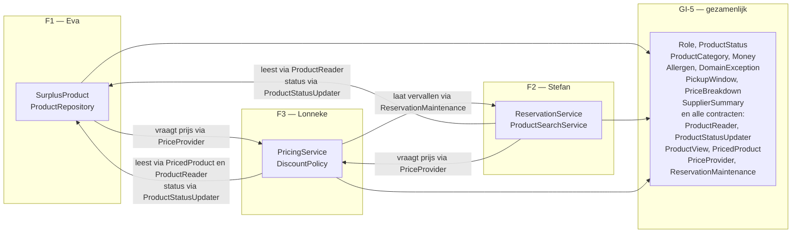

| # | Koppelvlak | Contract | Richting | Afspraak |
|---|-----------|----------|----------|----------|
| K-1 | F2 → F1 | `ProductReader`, `ProductStatusUpdater` | Lezen; de status wijzigen loopt via een apart contract | F2 leest partijen als `ProductView`, met de aanbieder als `SupplierSummary`, en wijzigt ze nooit rechtstreeks; statuswijzigingen lopen via `ProductStatusUpdater` |
| K-2 | F3 → F1 | `PricedProduct` | Alleen lezen | F3 ziet van een partij alleen wat voor de prijs nodig is: categorie, oorspronkelijke prijs en resterende houdbaarheid |
| K-3 | F2 → F3 | `PriceProvider` | Alleen lezen | F2 vraagt bij het zoeken de prijsopbouw op, om op te filteren en te tonen, en bij het reserveren de actuele prijs, om vast te leggen. F2 kent de afprijsregels niet. Bij een verlopen partij is het antwoord `null` |
| K-4 | F1 → F3 | `PriceProvider` | Alleen lezen | F1 toont de prijsopbouw in het detail van een partij, maar kent de afprijsregels niet. Nieuw in v1.1, doordat de aparte prijsendpoint is vervallen |
| K-5 | F3 → F2 | `ReservationMaintenance` | Laten vervallen | De statusbewaking laat alle reserveringen vervallen die over tijd zijn. De beheerder laat de actieve reservering van één partij vervallen voordat hij haar verwijdert (US-09). F2 bepaalt zelf welke reserveringen het zijn en voert het uit via de statusmachine (§9.5) |
| K-6 | F3 → F1 | `ProductReader`, `ProductStatusUpdater` | Lezen; de status wijzigen loopt via een apart contract | De statusbewaking vraagt welke partijen over de datum zijn en zet ze op `EXPIRED`. Het beheeroverzicht vraagt partijen op status op. De beheerder zet een partij op `REMOVED` |

Alle contracten staan in `shared` (GI-5). Zo gaan we werken; bijlage A legt in gewone taal uit wat dat voor ieder van ons betekent. Een feature kent daardoor alleen `shared` en nooit de package van een ander. De leverende feature implementeert het contract. F1 implementeert `ProductReader` en `ProductStatusUpdater`, en `SurplusProduct` implementeert de views `ProductView` en `PricedProduct`. F3 implementeert `PriceProvider` met `PricingService`, en F2 implementeert `ReservationMaintenance`. Welke implementatie bij welk contract hoort, ligt op één plek vast: bij het registreren van de dependencies in `Application.module()` (GI-2). In een test vervangt een fake het contract, zonder de andere feature op te tuigen.

De contracten gebruiken alleen typen uit `shared`. `ProductReader` geeft daarom geen `SurplusProduct` terug maar een `ProductView`: een interface met alleen leesbare eigenschappen. Via `ProductView` zijn er geen setters bereikbaar. Dat F2 een partij niet wijzigt, is daarmee geen afspraak meer maar volgt uit het type.

**De contracten per function.** Sinds de startsessie staan de contracten als code in `restpartijen-api/src/shared/`. De tabel hieronder volgt die code. Wijkt de code later af, dan is de code leidend en gaat deze tabel mee.

| Contract | Function of property | `suspend` | Belofte |
|----------|---------------------|-----------|---------|
| `ProductReader` | `findById(id): ProductView?` | ja | De partij met dit id, of `null` als zij niet bestaat |
| | `findAvailable(now): List<ProductView>` | ja | Partijen die `LISTED` zijn en op `now` nog houdbaar |
| | `findExpiredListings(now): List<ProductView>` | ja | Partijen die nog `LISTED` zijn, maar waarvan de datum op `now` verstreken is |
| | `findByStatus(statuses): List<ProductView>` | ja | Partijen met een van de gegeven statussen, voor het beheeroverzicht. Vervangt `findAll()` (B-26) |
| `ProductStatusUpdater` | `markReserved(productId): Boolean` | ja | `RESERVED`, alleen als de partij nog `LISTED` is; `false` als een ander eerder was |
| | `markListed(productId)` | ja | Van `RESERVED` terug naar `LISTED` |
| | `markCollected(productId)` | ja | Van `RESERVED` naar `COLLECTED` |
| | `markExpired(productIds): Int` | ja | De gegeven `LISTED`-partijen naar `EXPIRED`; geeft het aantal |
| | `markRemoved(productId): Boolean` | ja | Van `LISTED` naar `REMOVED`; `false` als de partij niet `LISTED` was |
| `ProductView` | `id`, `supplier`, `name`, `status`, `pickupWindow` | nee | Alleen lezen; erft van `PricedProduct` |
| `PricedProduct` | `originalPrice`, `category`, `shelfLifeRemaining(clock)` | nee | Wat de prijsberekening nodig heeft, en niet meer |
| `PriceProvider` | `currentPrice(product): Money?` | nee | De actuele prijs, of `null` bij een verlopen partij |
| | `priceBreakdown(product): PriceBreakdown?` | nee | Oorspronkelijke prijs, kortingspercentage en actuele prijs, of `null` bij een verlopen partij |
| `ReservationMaintenance` | `lapseOverdue(now): Int` | ja | Laat elke actieve reservering vervallen die op `now` over tijd is; geeft het aantal |
| | `lapseActiveFor(productId): Boolean` | ja | Laat de actieve reservering van één partij vervallen, voordat de beheerder haar verwijdert |

**Waarom `suspend` (B-21).** JDBC blokkeert: de thread die een query uitvoert, staat stil tot het antwoord er is. Ktor verwerkt verzoeken op een klein aantal threads. Daarom schuift de persistentielaag het databasewerk naar een aparte threadpool, met `suspendTransaction` binnen `withContext(Dispatchers.IO)` (GI-1, besluit 1.6). Dat zijn `suspend`-functions, en die kun je alleen aanroepen vanuit een andere `suspend`-function. Een `override` moet dezelfde vorm hebben als de function in de interface; `suspend` toevoegen bij het overschrijven kan niet. Het contract moet het dus al zeggen. `PriceProvider` en de views rekenen alleen en wachten nergens op. Zonder `suspend` zijn ze overal aan te roepen.

`ReservationMaintenance` geeft geen `Reservation` terug, alleen aantallen en `Boolean`s. `Reservation` is een klasse van F2 en staat niet in `shared`, dus een contract kan hem niet gebruiken.

**Waarom `findAll()` is vervangen door `findByStatus()` (B-26).** Het beheeroverzicht moet de partijen zonder verwijderde kunnen tonen, en ook alleen de verwijderde. Het contract had daarvoor `findAll()`, met in de code een open vraag of `REMOVED` erbij hoort. Eva heeft die vervangen door één function die een set statussen krijgt: `findByStatus(statuses: Set<ProductStatus>)`. Vier redenen. Eén: de keuze wat de beheerder ziet, hoort bij het beheeroverzicht, en dat is F3. `ProductReader` is data-toegang van F1 en maakt die keuze niet. Twee: één function dekt beide behoeften; alleen de set verschilt. Drie: een function `findAll` die niet alles geeft, heeft een naam die niet klopt. Vier: bij een volgende wens komt er geen tweede vlag bij, zoals bij een `Boolean` `includeRemoved`, en de compiler controleert de waarden. Voor de API betekent het een optioneel filter `status` op `GET /admin/products` (§5.9, §10.1). Het besluit is goedgekeurd en de function staat in `shared`. Wie `ProductReader` implementeert, moet mee: Eva's eigen implementatie en de fakes van Stefan en Lonneke. De compiler wijst ze vanzelf aan.

**Eén bewuste uitzondering.** `SeedData` (GI-1) schrijft bij het opstarten rechtstreeks in alle tabellen, ook in die van F2. Seeddata is geen gedrag van de applicatie maar de begintoestand van de database. Via contracten seeden zou voor elke tabel een schrijfcontract vragen dat daarna niemand meer gebruikt. De uitzondering geldt alleen voor `SeedData`, en alleen bij een lege database.

**Overwogen alternatief.** In v1.0 stond elk contract bij de aanroepende feature. Dat is afgewezen: F1 zou dan de packages van F2 en F3 moeten importeren om hun interfaces te implementeren, terwijl F2 de modelklassen van F1 nodig heeft. Dat is een afhankelijkheid in twee richtingen.

### 12.2 Wat bewust gedeeld blijft

| Onderdeel | Waarom gedeeld |
|-----------|----------------|
| `Role`, `ProductStatus`, `ProductCategory` | Alle drie de features lezen en schrijven deze waarden; drie eigen definities zouden direct uiteenlopen |
| `Money` | Prijzen komen in alle drie de features voor; één waardetype in hele centen voorkomt afrondingsverschillen (ADR-07) |
| `PickupWindow`, `PriceBreakdown`, `SupplierSummary` | Types die in een contract voorkomen: `ProductView` toont het afhaalvenster en de aanbieder, en `PriceProvider` geeft de prijsopbouw terug. Een contract in `shared` kan alleen typen uit `shared` gebruiken |
| `Allergen` | De EU-lijst van veertien allergenen (§9.8). De request body gebruikt dit type, dus een waarde buiten de lijst komt niet door de deserialisatie. De app in periode 2 toont dezelfde waarden |
| De contracten `ProductReader`, `ProductStatusUpdater`, `ProductView`, `PricedProduct`, `PriceProvider` en `ReservationMaintenance` | De afspraken tussen de features (§12.1); alleen interfaces, geen implementaties |
| `DomainException`-hiërarchie | `StatusPages` zet ze centraal om; één hiërarchie betekent één foutmodel voor de Android-app |
| Het foutantwoordformaat | Zie §10.2 |

Deze onderdelen staan in `shared` (GI-5) en hebben bewust geen eigenaar. Wijzigingen lopen via een pull request die alle drie reviewen. Uitzonderingen zijn de types die één student schrijft maar die meer features nodig hebben. `Money`, `Role` en `PriceBreakdown` blijven van Lonneke (§11.3), `PickupWindow` blijft van Eva (§11.1). Ze staan in `shared` omdat alle features ze gebruiken, of omdat ze in een contract voorkomen.

**Overwogen alternatief.** De gedeelde domeinkern bij één student in eigendom geven geeft een duidelijk aanspreekpunt en voorkomt dat een wijziging blijft liggen omdat niemand zich eigenaar voelt. Het is afgewezen omdat die student dan in code zit die alle drie de features raakt, en daarmee als bottleneck werkt bij elke wijziging die een ander nodig heeft.

### 12.3 Git-werkwijze

- `main` is altijd werkend. Niemand commit er rechtstreeks op.
- Elke student werkt op een eigen branch: `feature/f1-aanbod`, `feature/f2-reserveren`, `feature/f3-prijzen`.
- Werk aan de gedeelde basis, de onderdelen GI-1 tot en met GI-6, krijgt een eigen branch volgens het patroon `shared/<naam>-<onderdeel>`, bijvoorbeeld `shared/lonneke-security` (B-28).
- Mergen gebeurt uitsluitend via een pull request met minimaal één review door een groepsgenoot.
- Wijzigingen in `shared` (GI-5) vragen een review van beide anderen.
- Nederlands werkcommentaar mag op `main` staan (§3.2, B-37). Vóór de oplevering is er één controle: alle drie lopen de commentaarregels (`//`, `/*` en KDoc) in `../server/src` en `../server/test` na, en halen elke Nederlandse werknotitie weg of zetten de inhoud om naar Engels commentaar. Dat gaat via een pull request met twee reviews.
- Iedere student trekt dagelijks `main` binnen in de eigen branch, zodat afwijkingen klein blijven.

De reviewplicht is er niet alleen voor de codekwaliteit. Zij dwingt af dat iedereen elkaars code heeft gezien, wat rechtstreeks bijdraagt aan het voorwaardelijke criterium eigenaarschap (r.367). Daarnaast levert de PR-historie het bewijsmateriaal voor het filmpje, waarin getoond moet worden hoe Git is ingezet om samen te werken (r.183).

---

## 13. Gedeelde infrastructuur (GI-1 t/m GI-6)

Deze zes onderdelen worden gezamenlijk besloten in een startsessie en daarna door één student uitgevoerd. De besluiten staan hier expliciet, zodat niemand halverwege iets aanneemt dat een ander anders had bedacht.

De docent adviseert om de opzet van de features eerst gezamenlijk uit te werken, zodat iedereen daarna zelfstandig verder kan (§20). De startsessie levert daarom meer op dan besluiten. De packagestructuur staat er, de contracten in `shared` zijn geschreven (§12.1, bijlage A), en er loopt één endpoint met één tabel en één test door de hele keten (R-07). Pas daarna begint ieder aan de eigen feature.

### GI-1 Persistentielaag — uitvoering: Eva

**Doel.** Eén manier waarop alle drie de features data opslaan en ophalen, zodat entiteiten van verschillende eigenaren in dezelfde transactie kunnen leven.

| # | Besluit | Keuze | Waarom dit een besluit is |
|---|---------|-------|---------------------------|
| 1.1 | Exposed-API | DSL | DAO leest object-georiënteerd maar verbergt de SQL. De assessor vraagt expliciet naar de vertaling tussen OO en het relationele model (r.304); met de DSL is die vertaling zichtbaar in de code. |
| 1.2 | Database | H2. Tijdens de demo en in alle testen in-memory; een schakelaar naar bestand om te laten zien dat gegevens een herstart overleven | H2 is in beide standen een volwaardige relationele database; alleen de plek waar de gegevens staan verschilt. In-memory is leeg bij elke start en dwingt seeding af. Dat maakt de demo reproduceerbaar: de seeddata rekent met datums ten opzichte van het moment van vullen, dus een ouder bestand bevat alleen nog verlopen partijen. Voorstel van Eva als eigenaar van GI-1; bevestigd in de startsessie (B-17). De uitleg staat in bijlage B. |
| 1.3 | Repository-grens | Eén repository per entiteit | Eén per feature zou F2 rechtstreeks toegang geven tot de tabellen van F1 en het koppelvlak K-1 omzeilen. |
| 1.4 | Transactiegrens | Per service-aanroep | Een reservering wijzigt twee tabellen en moet in één transactie slagen of falen. |
| 1.5 | Exposed-modules | `exposed-core`, `exposed-jdbc` en `exposed-kotlin-datetime`, alle 1.5.0 | In 1.x zitten `Database`, `SchemaUtils` en `transaction` niet meer in `exposed-core` maar in `exposed-jdbc` (JetBrains s.r.o., 2026). Wie dat mist, ziet alleen onopgeloste imports. |
| 1.6 | Transacties vanuit coroutines | `suspendTransaction`, omhuld door `withContext(Dispatchers.IO)` | Route handlers en de Open Food Facts-client zijn `suspend`, terwijl JDBC blokkeert. `newSuspendedTransaction` uit oudere voorbeelden is in 1.x deprecated (JetBrains s.r.o., 2026). |
| 1.7 | Tijd in de database | `timestamp()` uit `exposed-kotlin-datetime` | Die kolom levert in 1.x een `kotlin.time.Instant` (JetBrains s.r.o., 2026). Dat is het type dat de injecteerbare `Clock` teruggeeft (GI-6, besluit 6.5), dus er is geen omrekening tussen tijdtypen nodig. |
| 1.8 | Generieke repository | `Repository<T>` staat in de persistentielaag en is van Eva; elke feature implementeert hem voor de eigen entiteit. De functions zijn `findById`, `findAll`, `create`, `update` en `delete`, alle `suspend`. `create` geeft het item terug met het id dat de database koos; `update` en `delete` geven `false` als er niets te wijzigen was. Een verwijderd item telt als niet gevonden | Eén vorm voor alle repositories houdt de features gelijk. De profgroep heeft op 19 september 2026 besloten dat Eva de interface schrijft, omdat GI-1 van haar is. Tot v2.2 stond hier één `save`. Daar was geen plek voor "item niet gevonden", en de Exposed DSL heeft toch al een aparte `insert` en `update`. Sinds v2.3 zijn het daarom twee functions (B-33). |

**Acceptatiecriteria.**
- Elke student kan een eigen tabel toevoegen zonder een bestand van een ander te wijzigen.
- De seeddata voldoet aan §9.7.
- De testopzet kan de database per test leegmaken zonder de productieconfiguratie aan te passen.

### GI-2 Applicatie-opzet — uitvoering: Stefan

**Doel.** Eén plek waar de applicatie wordt opgebouwd: plugins geïnstalleerd, dependencies geregistreerd, routes aangehaakt.

| # | Besluit | Keuze | Waarom dit een besluit is |
|---|---------|-------|---------------------------|
| 2.1 | Dependency injection | Ktor's eigen DI-plugin | Zie ADR-04. |
| 2.2 | Moduleopbouw | Eén `Application.module()` die per feature een `configureXRouting()` aanroept | Voorkomt dat drie studenten in hetzelfde routingbestand schrijven. |
| 2.3 | Configuratie | `application.yaml` met omgevingsvariabelen voor het JWT-secret. Onder `jwt` staan `secret` (uit `JWT_SECRET`), `issuer` (`restpartijen-api`), `audience` (`restpartijen-app`) en `validityHours` (`24`). `config` leest ze in als `JwtProperties`; `toString()` toont het secret als `***` | Secrets horen niet in de repository (§16.4). Met een gemaskeerde `toString()` belandt het secret niet per ongeluk in een log (§16.7). Namen afgesproken in het issue over security (B-36). |
| 2.4 | Engine | Netty | Standaardkeuze in de Ktor-projectgenerator; geen reden om af te wijken. |
| 2.5 | Buildtool | Kotlin Toolchain 0.12.0, één module `jvm/app` met `settings.ktor` | Voorgeschreven door de module (§3.2). We houden de standaardindeling van de toolchain aan: `../server/src` voor productiecode, `../server/test` voor testen en `../server/resources` voor `application.yaml` (JetBrains s.r.o., z.j.-j). De wrapperscripts `kotlin` en `kotlin.bat` staan in de repository, zodat iedereen zonder installatie kan bouwen, ook de assessor. De packages staan als mappen direct onder `../server/src`, zonder `com/restpartijen/api` (§8.3). |
| 2.6 | Versies van dependencies | `libs.versions.toml` in de projectroot; Ktor-artefacten via de BOM van `settings.ktor` | Eén plek voor alle versies voorkomt dat twee studenten dezelfde library in een andere versie toevoegen (JetBrains s.r.o., z.j.-e). |
| 2.7 | Starten | De `main` in `Application.kt` geeft de start door aan `EngineMain` van Netty. Die leest `../server/resources`, en daarin staan de poort en de module `com.restpartijen.api.ApplicationKt.module` | Ktor leest `application.yaml` alleen met de dependency `ktor-server-config-yaml` (JetBrains s.r.o., z.j.-d). De configuratie staat zo vanaf het begin op één plek; het JWT-secret en de schakelaar voor H2 komen er later bij. Uitgevoerd in de startsessie (B-29). |

**Acceptatiecriteria.**
- Een nieuwe feature is aan te haken door één regel toe te voegen aan `Application.module()`.
- `testApplication` kan elke service door een fake vervangen zonder de productiecode te wijzigen.
- De applicatie start zonder handmatige stappen na `./kotlin run` (op Windows `kotlin.bat run`), ook op een machine waarop nog geen JDK staat.

### GI-3 Authenticatie en rollen — uitvoering: Lonneke

**Doel.** Eén manier waarop de API vaststelt wie de aanroeper is en wat die mag.

| # | Besluit | Keuze | Waarom dit een besluit is |
|---|---------|-------|---------------------------|
| 3.1 | Mechanisme | JWT via de `Authentication`-plugin, geïnstalleerd met `install(Authentication)` | Stateless, werkt zonder sessieopslag en sluit aan op de Android-app in periode 2 (JetBrains s.r.o., z.j.-g). Ktor 3.6.0 heeft een nieuwe, typed authentication-API, maar die is experimenteel (JetBrains s.r.o., z.j.-n). Wij gebruiken haar niet (B-14). |
| 3.2 | Rollen in het token | Eén claim `role` met één waarde | Een gebruiker heeft in dit domein precies één rol. Een lijst zou suggereren dat combinaties mogelijk zijn. |
| 3.3 | Claimnaam en -vorm | `role`, hoofdletters, exact de namen uit de `Role`-enum | Een verschil in schrijfwijze tussen uitgeven en controleren is een fout die pas bij het samenvoegen zichtbaar wordt. |
| 3.4 | Wachtwoordopslag | Argon2id, via `Argon2PasswordEncoder` uit Spring Security Crypto; `PasswordHasher` in `security` | Wachtwoorden worden gehasht en niet versleuteld: een hash is niet terug te rekenen naar het wachtwoord. OWASP noemt Argon2id als eerste keuze (OWASP Foundation, z.j.). Tot v2.2 stond hier BCrypt (B-34). De Spring-encoder heeft Bouncy Castle nodig voor het Argon2-algoritme (Spring, z.j.-b). |
| 3.5 | Geldigheidsduur | 24 uur | Lang genoeg voor een demo, kort genoeg om verdedigbaar te zijn. |
| 3.6 | Verdeling van de autorisatie | Het mechanisme is gedeeld en van Lonneke: de JWT-configuratie, het uitlezen van de principal en de kern van de rolcheck. Welke rol welk endpoint mag aanroepen, schrijft iedere student zelf in de routing van de eigen feature | Advies van de docent (§20, optie B). Zo kennen alle drie de uitwerking van de autorisatie, en kan iedere student eigen autorisatielogica aanwijzen (r.367). |
| 3.7 | Registreren | `/auth/register` maakt uitsluitend `COLLECTOR`-accounts aan; de rol komt nooit uit het verzoek. Accounts voor aanbieders en de beheerder komen uit de seeddata | Een open registratie waarbij de aanroeper zelf een rol kiest, is een directe route naar `ADMIN`. De profgroep heeft op 19 september 2026 besloten dat de endpoint blijft: de app in periode 2 gebruikt hem, en Lonneke heeft er een POST met validatie mee. |
| 3.8 | Antwoord van `/auth/login` | Het antwoord bevat het token, de rol en, bij een aanbieder, het `supplierId` | De app bepaalt met de rol welke schermen zij toont en heeft het `supplierId` nodig voor `GET /suppliers/{id}/products` (§18.4). Staan die gegevens niet in het antwoord, dan moet de app ze uit het token lezen, en dan is zij gebonden aan de vorm van ons token. De profgroep heeft dit op 19 september 2026 besloten. |
| 3.9 | Plek in de code | De package `security` bevat de installatie van de `Authentication`-plugin, `JwtConfig` en de endpoints `/auth/register` en `/auth/login`. `Application.module()` roept één function uit `security` aan, na de plugins en vóór de routing. `config` (Stefan) leest de JWT-instellingen in (besluit 2.3) | `JwtConfig` bouwt en valideert de tokens en hoort daarom bij het gedeelde mechanisme van Lonneke (§11.3). Zo staat alles van GI-3 in één package. Afgesproken in de startsessie (B-29); de indeling binnen `security` volgt nog (§21). Tot v2.2 stond hier dat `config` alleen het secret inleest; in het issue over security is dat alle vier de instellingen geworden (B-36). |
| 3.10 | Foutmeldingen | De challenge gooit `UnauthorizedException`, de rolcheck gooit `ForbiddenException`; `StatusPages` (GI-4) maakt het antwoord. `validate` geeft `null` en gooit nooit | Eén vorm voor alle foutmeldingen, op één plek (§10.2). Gekozen als optie 1 in het issue over security, tegenover security die zelf een antwoord stuurt. Dat laatste zou de vorm van een `401` op twee plekken vastleggen (B-35). |
| 3.11 | JWT-instellingen in `security` | `JwtConfig` werkt met `JwtSettings` uit `security`, niet rechtstreeks met `JwtProperties` uit `config`. De provider heet `jwt-auth`, als constante `PROVIDER_NAME` in `security` | Twee klassen met elk een eigen taak: `JwtProperties` leest in, `JwtSettings` is wat het tokenmechanisme gebruikt. In tests vult Lonneke `JwtSettings` met vaste waarden zonder `application.yaml`. Afgesproken tussen Stefan en Lonneke in het issue (B-36). |

**Acceptatiecriteria.**
- Een aanroep zonder token op een beschermde endpoint levert `401`.
- Een aanroep met een geldig token maar de verkeerde rol levert `403`.
- De rolcheck is met een integratietest per beschermde endpoint gedekt.
- Registreren levert `201 Created` en een account met rol `COLLECTOR`, ook als het verzoek een andere rol meestuurt.
- Registreren met een e-mailadres dat al bestaat levert `409 Conflict`.
- Het antwoord op inloggen bevat de rol en, bij een aanbieder, het `supplierId`.
- Het antwoord op registreren en inloggen bevat nooit het wachtwoord of de hash.
- Iedere student heeft de rolregels van de eigen endpoints zelf geschreven; het gedeelde mechanisme bevat geen regels per endpoint.
- Een `401` en een `403` hebben de foutvorm uit §10.2.

> **Opmerking v2.3 — voor Lonneke: de parameters van Argon2id.** `PasswordHasher` gebruikt `Argon2PasswordEncoder.defaultsForSpringSecurity_v5_8()`. Die standaard rekent met 16 MiB geheugen, 2 iteraties en parallelisme 1 (Spring, z.j.-b). OWASP noemt als minimum 19 MiB bij 2 iteraties, of 12 MiB bij 3 iteraties (OWASP Foundation, z.j.). De standaard van Spring zit daar dus onder. De encoder heeft ook een constructor waarin je de waarden zelf opgeeft. Dat is een keuze voor jou; zet de waarden en de bron erbij in de KDoc. Over de library zelf: in het issue onderbouwt Lonneke Spring Security Crypto met actief onderhoud en recente stabiele versies, met de documentatie van Spring als bron (Spring, z.j.-a). In het issue ging het nog om bcrypt. Waarom het Argon2id werd, staat er niet bij. De overstap volgt wel uit de eerste keuze van OWASP. Zet die reden bij de library in `../server/module.yaml`. Daar staat nu "well-known and widely used", en dat zegt iets anders dan het issue.

### GI-4 Foutafhandeling — uitvoering: Stefan

**Doel.** Eén foutmodel voor de hele API, zodat de Android-app in periode 2 maar één vorm hoeft te kennen.

| # | Besluit | Keuze | Waarom dit een besluit is |
|---|---------|-------|---------------------------|
| 4.1 | Excepties naar statuscodes | Centraal in `StatusPages` | Per route afhandelen zou dezelfde logica drie keer opleveren, met kans op verschillen (JetBrains s.r.o., z.j.-k). |
| 4.2 | Exceptiehiërarchie | Eén `abstract` class `DomainException` als basis, in `shared` | Een nieuwe exception erft en wordt automatisch correct afgehandeld. `abstract` en niet `sealed`: zie §10.2 (B-22). |
| 4.3 | Foutantwoord | `{ code, message, field? }` | Één vaste vorm; `field` alleen bij validatiefouten. |
| 4.4 | Stacktraces | Nooit in het antwoord, wel in de log | Een stacktrace in een antwoord lekt implementatiedetails. |

**Acceptatiecriteria.**
- Elke exception uit de tabel in §10.2 levert de bijbehorende statuscode.
- Een onverwachte exception levert `500` met een algemene melding, zonder stacktrace.
- Er is een integratietest per statuscode uit de tabel.

### GI-5 Gedeelde domeinkern — geen eigenaar, PR met review door alle drie

**Doel.** Vastleggen wat van niemand alleen is, zodat het niet stilzwijgend bij één feature belandt. Hoe het werken met de contracten in `shared` gaat, staat in bijlage A.

| # | Besluit | Keuze | Waarom dit een besluit is |
|---|---------|-------|---------------------------|
| 5.1 | Inhoud | `Role`, `ProductStatus`, `ProductCategory`, `Money`, `Allergen` (de EU-lijst, §9.8), `PickupWindow`, `PriceBreakdown`, `SupplierSummary`, `DomainException`, en de contracten uit §12.1: `ProductReader`, `ProductStatusUpdater`, `ProductView`, `PricedProduct`, `PriceProvider` en `ReservationMaintenance` | Alles wat twee of meer features nodig hebben. Wat maar één feature gebruikt, hoort in die feature. |
| 5.2 | Eigendom | Geen eigenaar, behalve `Money`, `Role` en `PriceBreakdown` (Lonneke, §11.3) en `PickupWindow` (Eva, §11.1); wijziging via PR met review door beide anderen | Zie de afweging in §12.2. |
| 5.3 | Wijzigingsregel | Toevoegen mag; wijzigen of verwijderen vraagt overleg vooraf | Een gewijzigde enumwaarde breekt stilzwijgend de code van twee anderen. |
| 5.4 | Geen logica | Alleen waardetypes, enums en contracten (interfaces); geen implementaties | Logica in de gedeelde kern zou opnieuw een gedeeld eigenaarschapsprobleem opleveren. Een interface als `PriceProvider` is een afspraak en geen logica. |

**Acceptatiecriteria.**
- Geen enkele klasse in `shared` heeft een afhankelijkheid naar een featurepackage.
- Geen featurepackage importeert een andere featurepackage; onderling contact loopt via de contracten in `shared`.
- Elke wijziging in `shared` is via een PR met twee reviews gegaan.

### GI-6 Testopzet — uitvoering: gezamenlijk in de startsessie

**Doel.** Eén manier van testen voor alle drie de features, zodat de testen van verschillende eigenaren in dezelfde build draaien en niemand een eigen opzet bouwt.

| # | Besluit | Keuze | Waarom dit een besluit is |
|---|---------|-------|---------------------------|
| 6.1 | Testframework | `kotlin.test` op het JUnit Platform | De Kotlin Toolchain configureert `kotlin.test` standaard, dus er is geen eigen testconfiguratie nodig (JetBrains s.r.o., z.j.-l). `kotlin.test` leest idiomatischer in Kotlin dan JUnit-assertions. |
| 6.2 | Integratietesten | `testApplication` uit `ktor-server-test-host` | De officiële aanpak van Ktor: start de applicatie in het geheugen zonder poort, en kan dependencies vervangen (JetBrains s.r.o., z.j.-m). |
| 6.3 | Mocken | MockK | Kotlin-first: kan final classes, object declarations en `suspend` functions mocken, waar Mockito op vastloopt (MockK, z.j.). Relevant omdat `DiscountPolicyResolver` een object is en de Open Food Facts-client `suspend` is. |
| 6.4 | Dubbels voor repositories | Fakes, geen mocks. Voor `Repository<T>` is er één generieke `FakeRepository<T>` in `../server/test/testsupport`; `FakeRepositoryTest` laat zien hoe je hem gebruikt | Een fake repository met een `MutableList` is leesbaarder en breekt niet bij elke refactor. Met één generieke fake schrijft niet iedereen een eigen versie (B-33). Mocks worden alleen gebruikt waar gedrag geverifieerd moet worden, zoals de time-out van de externe client. |
| 6.5 | Tijd in testen | Injecteerbare `kotlin.time.Clock`, nooit rechtstreeks `Clock.System` | Zonder vaste klok zijn de afprijsstaffels, het afgeleide afhaalvenster en de statusbewaking niet reproduceerbaar te testen. `Clock` en `Instant` zitten sinds Kotlin 2.3 in de standard library, en de documentatie raadt zelf aan een `Clock` door te geven in plaats van `Clock.System` aan te roepen (JetBrains s.r.o., z.j.-b). Dit is een harde regel, geen voorkeur. |
| 6.6 | Testdatabase | H2 in-memory, per test leeggemaakt | Elke test start van een bekende toestand; geen volgorde-afhankelijkheid tussen testen. |
| 6.7 | Plaats van de testen | De map `../server/test` van de module; MockK en `ktor-server-test-host` onder `test-dependencies` in `../server/module.yaml` | Dit wijkt af van `../server/src` uit vrijwel elk voorbeeld. Vastleggen voorkomt dat testen op een plek belanden waar de toolchain ze niet vindt (JetBrains s.r.o., z.j.-l). |

**Wat per laag getest wordt.**

| Laag | Soort test | Waarmee | Wat wordt vastgesteld |
|------|-----------|---------|------------------------|
| Domeinlogica (afprijsstaffels, afhaalvenster, statusmachine, validatie) | Unittest | `kotlin.test`, vaste `Clock` | De berekening en de regels kloppen, ook op grenswaarden |
| Servicelaag | Unittest | Fake repository, MockK voor externe client | De flow klopt zonder database of netwerk |
| Routing, validatie, autorisatie, foutafhandeling | Integratietest | `testApplication` met vervangen dependencies | De juiste statuscode bij de juiste situatie |
| Persistentie | Integratietest | H2 in-memory | Het schema klopt en relaties laden correct |

**Acceptatiecriteria.**
- Iedere student heeft minimaal drie zinvolle, diverse unittesten, verdeeld over happy flow en edge cases (r.200-201).
- Alle vier de CRUD-requestsoorten zijn met een integratietest gedekt (r.202).
- Elke beschermde endpoint heeft een test zonder token, met de verkeerde rol en met de juiste rol (§8.6).
- De volledige testsuite draait zonder netwerkverbinding: de Open Food Facts-client is in testen altijd vervangen.
- De testsuite is volgordeonafhankelijk: twee keer draaien in willekeurige volgorde levert hetzelfde resultaat.

---

## 14. Niet-functionele eisen (NFR)

Performance, beschikbaarheid en autorisatie staan als kwaliteitsscenario in §8.6, direct bij de architectuur. Hier staan alleen de eisen aan de code zelf.

| ID | Onderwerp | Eigenschap | Meeteenheid | Drempel | Verificatie |
|----|-----------|------------|-------------|---------|-------------|
| NFR-03 | Servicelaag | testdekking | regeldekking | ≥ 80% | Coverage-run in IntelliJ IDEA; de export gaat in de testrapportage |
| NFR-05 | Broncode | onderhoudbaarheid | aantal warnings bij compilatie | 0 | `allWarningsAsErrors` onder `settings.kotlin` in `../server/module.yaml`: een warning laat de build falen |
| NFR-06 | Prijsberekening | reproduceerbaarheid | afwijking bij gelijke klok | 0 | Unittest met een vaste `Clock` |

De verificatie van NFR-03 en NFR-05 is in v1.1 aangepast aan de Kotlin Toolchain. De toolchain heeft in versie 0.12.0 geen instelling voor testdekking (JetBrains s.r.o., z.j.-j), en Kover bestaat als plugin voor Gradle en Maven. De dekking wordt daarom in de IDE gemeten en niet in de build. In de startsessie is vastgesteld dat die meting werkt op dit toolchain-project (B-16). De drempel van NFR-03 blijft daarmee staan. Dokka is een tip en geen eis (r.195); de KDoc in de broncode blijft leidend.

---

## 15. Privacy by design

De applicatie bevat alleen verzonnen seeddata en komt niet in productie. Het ontwerp beschrijft wel een platform dat bij echt gebruik onder de AVG zou vallen. Daarom staat hier kort welke persoonsgegevens het model kent en welke keuzes daarbij horen.

| Veld | Waarvoor |
|------|----------|
| `email`, `password_hash` | Inloggen en identificatie |
| `display_name` | Herkenbaarheid voor de aanbieder bij een reservering |
| `address`, `latitude`, `longitude` | Locatie van de aanbieder, om aanbod in de buurt te tonen |
| `reservations.collector_id` | Een reservering koppelen aan een afhaler |

Drie keuzes in het ontwerp volgen hieruit:

- **Dataminimalisatie.** Van een afhaler vragen we alleen een e-mailadres en een weergavenaam. De locatie van de afhaler blijft op het toestel: de app berekent de afstand zelf en stuurt de locatie niet naar de API (§18.1).
- **Doelbinding.** Reserveergegevens dienen alleen om de reservering af te handelen, niet om profielen op te bouwen.
- **Privacyvriendelijke standaard.** De locatie van een aanbieder is zichtbaar, de identiteit van een afhaler niet. De aanbieder ziet bij een reservering alleen de weergavenaam.

Allergenen horen bij het product en niet bij de gebruiker; er worden dus geen gezondheidsgegevens van personen opgeslagen. Accounts verwijderen en gegevens opruimen na een bewaartermijn horen bij een echte uitrol. Ze vallen buiten de scope van dit project: er is geen user story en geen endpoint voor.

---

## 16. Security by design

### 16.1 Authenticatie en sessiebeheer

- Methode: JWT, uitgegeven door `/auth/login`, gevalideerd door de `Authentication`-plugin.
- Geldigheidsduur: 24 uur. Geen refresh tokens — buiten scope voor dit project.
- Wachtwoorden worden met Argon2id gehasht en nooit omkeerbaar opgeslagen (GI-3, besluit 3.4).
- Alleen de server hasht. De app stuurt het wachtwoord naar de API en hasht zelf niets.

### 16.2 Autorisatiemodel

Wie wat mag, staat in §1.3. Hier staat hoe dat wordt afgedwongen.

- Model: RBAC met drie rollen, één rol per gebruiker. De rol staat als claim in het JWT.
- Ktor levert authenticatie maar geen rolgebaseerde autorisatie; de rolcontrole schrijven we zelf (JetBrains s.r.o., z.j.-a). Zij gebeurt bij binnenkomst, voordat de service wordt aangeroepen. Het mechanisme is gedeeld (GI-3); welke rol welk endpoint mag aanroepen, schrijft iedere student zelf in de routing van de eigen feature (§20).
- De eigenaarscontrole is een tweede, aparte stap: de service vergelijkt de eigenaar van de partij of de reservering met de gebruiker uit het token. In F1 doet `OwnershipGuard` dat.
- De testen hierbij staan in GI-6: per beschermde endpoint één zonder token, één met de verkeerde rol en één met de juiste rol.

### 16.3 Versleuteling

- In transit: de applicatie draait lokaal over HTTP. In een echte uitrol zou TLS verplicht zijn; dat is hier bewust niet geïmplementeerd omdat er geen netwerkblootstelling is.
- At rest: geen versleuteling van de H2-database. Er staan geen echte persoonsgegevens in.

### 16.4 Secrets

Het JWT-secret komt uit de omgevingsvariabele `JWT_SECRET` en staat niet in de repository. De `application.yaml` bevat een placeholder, geen waarde. Er is een `.env.example` met de benodigde variabelen zonder inhoud. In de code van 3 oktober 2026 start de applicatie niet zonder `JWT_SECRET`, en een secret moet minstens 32 bytes zijn. Of er een terugval komt voor ontwikkelen, is nog open (§21).

### 16.5 Invoervalidatie

Alle invoer wordt gevalideerd voordat zij de servicelaag bereikt (§10.2). Exposed gebruikt geparametriseerde queries, waardoor SQL-injectie langs de DSL niet mogelijk is. Er wordt geen dynamische SQL uit gebruikersinvoer samengesteld.

### 16.6 Afhankelijkheden

De afhankelijkheden worden vastgezet in `libs.versions.toml` in de projectroot, de projectcatalogus van de Kotlin Toolchain (JetBrains s.r.o., z.j.-e). De Ktor-artefacten krijgen hun versie van de Ktor-BOM die `settings.ktor` aanzet. Er wordt geen automatische scan ingericht; voor een schoolproject zonder productieomgeving is dat niet proportioneel. Het is wel een bekend en bewust geaccepteerd gat.

### 16.7 Logging

Requests worden gelogd via `CallLogging` voor demonstratie en foutzoeken. Wachtwoorden, tokens en de `Authorization`-header worden nooit gelogd.

---

## 17. Risico's

| ID | Risico | Kans | Impact | Maatregel | Eigenaar |
|----|--------|------|--------|-----------|----------|
| R-01 | Het ambitieniveau "goed" op realisatie en testen vraagt volume dat in week zeven niet meer in te halen is | Hoog | Hoog | Wekelijks toetsen of alle use cases nog op schema liggen; bij achterstand vroeg terugvallen op "voldoende" voor die twee criteria in plaats van laat | Alle drie |
| R-02 | De gedeelde domeinkern heeft geen eigenaar, waardoor een noodzakelijke wijziging blijft liggen | Midden | Midden | Wijzigingen in `shared` krijgen voorrang in de reviewvolgorde | Alle drie |
| R-03 | Vervallen. De docent heeft de vraag over de RBAC-verdeling beantwoord: optie B (§20) | — | — | — | — |
| R-04 | Open Food Facts is tijdens het assessment onbereikbaar of de rate limit is bereikt | Laag | Midden | Cache per barcode, terugval op handmatige invoer, en een voorbereide demo met gecachete gegevens | Eva |
| R-05 | Het domein oogt voorspelbaar, waardoor de complexiteit onvoldoende blijkt | Midden | Midden | De onderscheidende logica zit in de afprijsstaffels per productsoort, de prijs die bij het reserveren wordt vastgelegd, het afhaalvenster dat uit openingstijden wordt afgeleid en de twee automatische statusovergangen; die worden expliciet in de demo getoond. Door de staffels is het verschil tussen de drie policies kleiner geworden (ADR-06) | Lonneke |
| R-06 | Merge-conflicten in de gedeelde infrastructuur vertragen alle drie | Laag | Midden | Featuregerichte packages (ADR-01), dagelijks `main` binnentrekken, koppelvlakken als interfaces | Stefan |
| R-07 | De Kotlin Toolchain is Alpha en Exposed 1.x is nieuw. Voorbeelden en suggesties van AI-tooling gaan uit van Gradle en van Exposed 0.x, en leveren dus code en configuratie op die niet werkt | Hoog | Midden | In de startsessie een walking skeleton bouwen: één endpoint, één tabel en één test door de hele keten, vóórdat iemand aan een feature begint. Versies vastzetten en tijdens het project niet verhogen, tenzij de docent het voorschrijft, zoals bij Ktor 3.6.0 (§3.2). De officiële documentatie is de bron, niet de AI-suggestie; afwijkingen komen in het AI-logboek. Blijkt de toolchain een blokkade, dan gaat dat direct naar de docent | Stefan (GI-2), Eva (GI-1) |

---

## 18. Vooruitblik periode 2

Deze paragraaf legt de keuzes vast die nu al gemaakt moeten worden, omdat het sensoronderwerp vooraf beoordeeld moet worden (r.66).

### 18.1 Sensoren

| Sensor | Toepassing | Status |
|--------|------------|--------|
| Camera | Barcode scannen bij het plaatsen van een partij; voedt de Open Food Facts-koppeling van F1 | Goedgekeurd |
| GPS | Aanbod in de buurt tonen, in een lijst en op een kaart. De app berekent de afstand zelf met de coördinaten van de aanbieder; de locatie van de afhaler gaat niet naar de API | Goedgekeurd |
| Accelerometer | Schudden om de lijst met aanbod te verversen | Reserve |

Camera en GPS zitten in de gebruikersflow: zonder camera moet de aanbieder alles typen, zonder GPS kan de afhaler niet op afstand filteren. Beide zijn dus onderdeel van het ontwerp en niet aangeplakt.

**Het aanbod op de kaart.** Op advies van de docent (§20) leggen we vast dat het aanbod ook op een kaart komt. Elke aanbieder met aanbod is een marker op zijn eigen coördinaten, en de positie van de afhaler komt uit de GPS. Daarvoor gebruiken we MapLibre Compose, een open source kaartbibliotheek voor Compose die in de les wordt behandeld als alternatief voor Google Maps (MapLibre, z.j.). De API hoeft er niets extra's voor te doen: de coördinaten van de aanbieder zitten al in het zoekresultaat (§18.3).

De accelerometer is de reservekeuze en is bewust als zodanig benoemd. Schudden om te verversen heeft geen inhoudelijke reden in dit domein; de waarde ervan is dat de sensor zonder extra hardware te demonstreren is als camera of GPS technisch tegenvalt.

**Overwogen alternatieven.** NFC bij het ophalen was inhoudelijk de sterkste derde optie: de afhaler houdt de telefoon tegen een tag bij de winkel, wat de statusovergang `RESERVED → COLLECTED` zou bevestigen en aansluit op logica die er al is. Het is niet als reserve gekozen omdat het een fysieke tag vereist om te demonstreren, waarmee het als achtervang juist onbruikbaar wordt. Spraakinvoer via de microfoon is afgewogen en afgewezen: het is een andere manier van typen en voegt niets toe aan het domein.

### 18.2 Navigatiestructuur

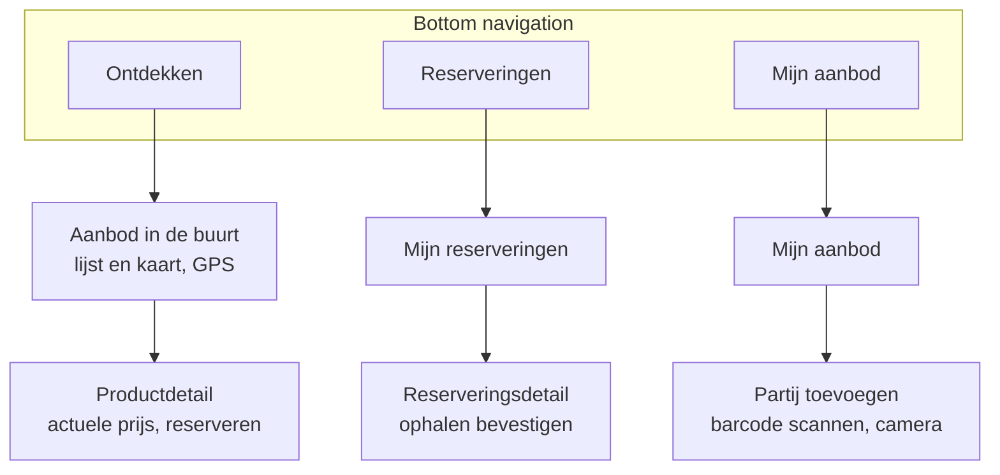

Drie tabs met detailschermen daaronder, wat ruim voldoet aan de eis van minimaal drie schermen (r.85). Elke tab hoort bij een feature uit periode 1, waardoor de app zichtbaar op deze API leunt.

**Overwogen alternatief en logische doorontwikkeling.** Rol-afhankelijke navigatie — waarbij de afhaler andere tabs ziet dan de aanbieder, op basis van de rol uit het JWT — sluit strakker aan op het rollenmodel en zou autorisatie ook in de interface zichtbaar maken. Het is voor periode 2 niet gekozen omdat één vaste navigatiestructuur eenvoudiger te toetsen is en minder UI-testen vraagt. Het blijft de meest voor de hand liggende doorontwikkeling van de app.

### 18.3 Wat de API nu al biedt voor periode 2

- Eén foutmodel voor de hele API (§10.2), zodat de app maar één vorm hoeft af te handelen.
- `CORS` is geïnstalleerd (ADR-05), zodat de app zonder aanpassing aan de backend kan aansluiten.
- De prijs wordt server-side berekend, zodat de app geen afprijslogica hoeft te dupliceren.
- De prijsopbouw staat in het antwoord van de partij zelf, zodat de app voor een lijst of een detailscherm geen extra aanroep per partij nodig heeft.
- De zoek-endpoint is openbaar, zodat de app aanbod kan tonen voordat de gebruiker inlogt.
- Elke partij in het zoekresultaat bevat de naam en de coördinaten van de aanbieder. De app berekent daarmee zelf de afstand, en de locatie van de afhaler verlaat het toestel niet. Dezelfde coördinaten zetten de aanbieder op de kaart.

**Mogelijke uitbreiding.** De docent ziet ruimte voor een chart library, bijvoorbeeld om het prijsverloop van een partij te tonen (§20). Met staffels wordt dat een trapgrafiek: de prijs blijft gelijk tot een grens en zakt dan in één stap. De API levert nu alleen de actuele prijsopbouw. Voor een grafiek moeten ook de staffels van de partij in het antwoord staan. Dat is een kleine uitbreiding, maar wel extra scope. De profgroep besluit erover bij de start van periode 2 (§21).

### 18.4 Request-flow tussen de app en de API

Deze paragraaf beschrijft per use case welke requests de app naar de API stuurt, in welke volgorde, en wat de app met het antwoord doet. De schermen komen uit §18.2, de endpoints uit §10.1. Drie regels gelden voor elke flow. Bekijken kan zonder inloggen; pas bij een actie die een rol vraagt, stuurt de app het JWT mee in de `Authorization`-header. Verloopt het token, dan antwoordt de API met `401` en stuurt de app de gebruiker naar het inlogscherm, want er zijn geen refresh tokens (§16.1). En elke fout heeft dezelfde vorm (§10.2), dus de app handelt fouten op één plek af. Bij `422` toont zij de melding uit het antwoord bij het juiste veld, bij `409` ververst zij de gegevens, en een `400` is een fout in de app zelf en niet van de gebruiker.

| Use case | Scherm (§18.2) | Requests in volgorde | Wat de app ermee doet |
|----------|----------------|----------------------|-----------------------|
| Aanbod in de buurt bekijken (US-04, US-07) | Ontdekken: lijst en kaart | `GET /products` met de gekozen filters | Toont de partijen met hun actuele prijs. Berekent per partij de afstand met de GPS-positie en de coördinaten van de aanbieder, en zet elke aanbieder als marker op de kaart. De positie van de afhaler gaat niet mee in het request |
| Eén partij bekijken (US-07) | Productdetail | `GET /products/{id}` | Toont de prijsopbouw: oorspronkelijke prijs, korting en actuele prijs. Is de partij intussen verlopen, dan komt zij terug met status `EXPIRED` en zonder prijs, en toont de app dat zij niet meer beschikbaar is |
| Inloggen | Inlogscherm; verschijnt bij de eerste actie die een rol vraagt | `POST /auth/login` | Bewaart het token en gaat terug naar de actie waar de gebruiker mee bezig was. Bij `401` kloppen e-mailadres of wachtwoord niet |
| Account aanmaken | Inlogscherm, via "registreren" | `POST /auth/register` | Bij `201` logt de app de gebruiker daarna in. Bij `409` bestaat het e-mailadres al. Een nieuw account is altijd een afhaler |
| Partij reserveren (US-05) | Productdetail | `POST /reservations` met het `productId` | Bij `201` toont de app de reservering met de vastgelegde prijs (§9.4), het afhaalvenster en het moment tot wanneer zij geldig is (maximaal 24 uur). Bij `409` was een ander eerder of is de partij verlopen: melding, daarna een ververste lijst. Bij `422` is het afhaalvenster voorbij. Bij `403` is de gebruiker geen afhaler |
| Eigen reserveringen bekijken | Mijn reserveringen | `GET /reservations` | Toont de eigen reserveringen met hun status. De API leest uit het token om wie het gaat; de app stuurt geen gebruikers-id mee |
| Reservering intrekken (US-06) | Reserveringsdetail | `DELETE /reservations/{id}` | Bij `204` verdwijnt de reservering uit de lijst. Bij `409` was zij al opgehaald |
| Ophalen bevestigen (US-11) | Reserveringsdetail, aan de balie van de aanbieder | `POST /reservations/{id}/collect` | Bij `200` toont de app een bevestigingsscherm dat de aanbieder kan zien; pas dan geeft hij de partij mee (§5.11). Bij `422` valt het moment buiten het afhaalvenster, bij `409` is de reservering al afgehandeld of vervallen |
| Partij plaatsen met de barcode (US-01, US-02) | Partij toevoegen | 1. De camera leest de barcode. 2. `GET /products/lookup/{barcode}`. 3. De aanbieder controleert de voorzet en vult aan. 4. `POST /products` | Na stap 2 vult de app het formulier voor met naam en allergenen. Bij `404` of een leeg antwoord typt de aanbieder alles zelf; het plaatsen gaat gewoon door. Na stap 4: bij `201` terug naar Mijn aanbod, bij `422` de melding bij het juiste veld |
| Eigen aanbod beheren (US-03) | Mijn aanbod | 1. `GET /suppliers/{id}/products`. 2. `PUT /products/{id}` of `DELETE /products/{id}` | Toont het eigen aanbod en verwerkt de wijziging. Een gereserveerde partij is niet te verwijderen (`409`); de app legt uit waarom |
| Openingstijden vastleggen (US-10, Should) | Mijn aanbod | 1. `GET /suppliers/{id}/opening-hours`. 2. `PUT /suppliers/{id}/opening-hours` | Toont de huidige tijden en slaat de wijziging op. Bij `422` ligt een sluitingstijd niet na de openingstijd |

In de navigatie van §18.2 zit geen beheerscherm. De beheerfuncties (US-08 en US-09) blijven daarom buiten de app en worden aangeroepen met de HTTP client van IntelliJ (§8.2).

Het diagram hieronder toont de hoofdroute van een afhaler, van de kaart tot het ophalen. Anders dan de sequence diagrams in §8.5 laat het alleen zien wat er tussen de app en de API heen en weer gaat.

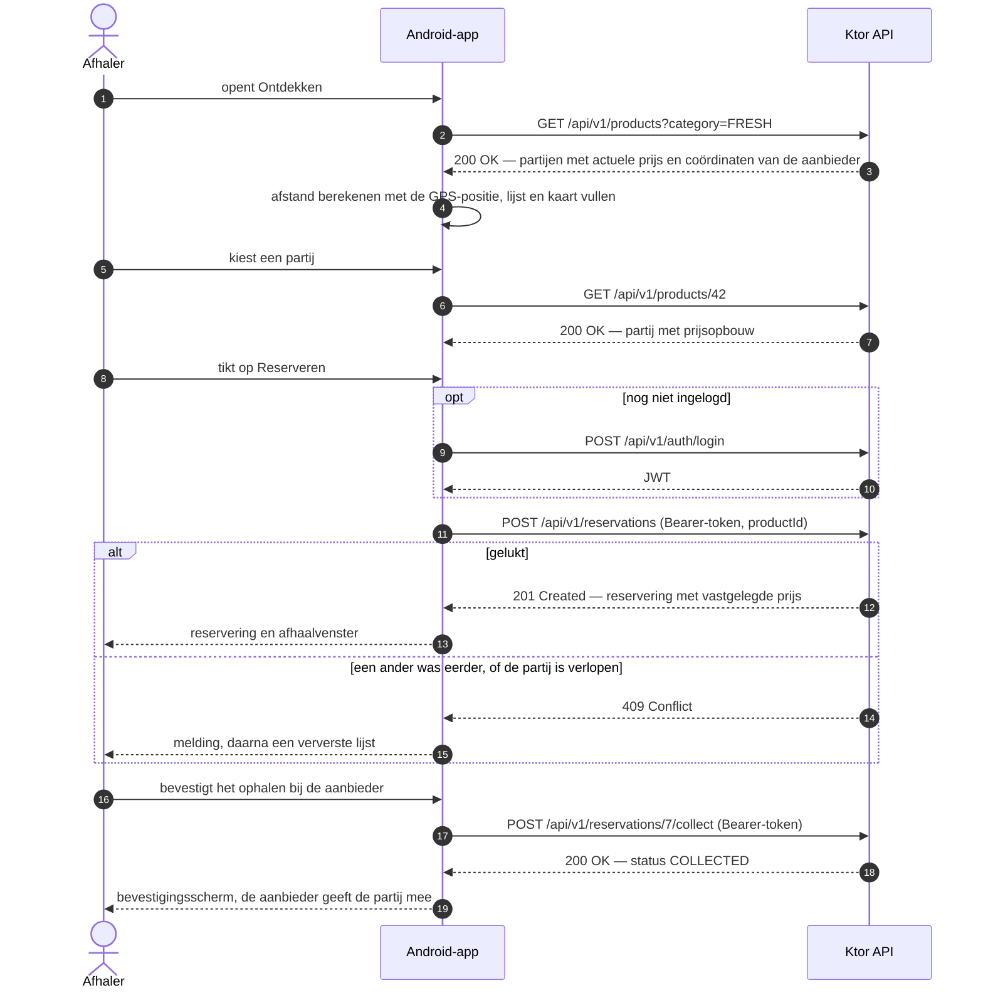

Twee dingen worden door deze flows zichtbaar. De prijs op het scherm kan ouder zijn dan de prijs bij het reserveren, want de prijs beweegt met de tijd. De staffels laten een prijs alleen zakken, dus de vastgelegde prijs valt voor de afhaler nooit hoger uit dan wat hij zag. De app toont na het reserveren altijd de prijs uit het antwoord. Daarnaast moet de app na het inloggen weten welke rol de gebruiker heeft en, bij een aanbieder, welk `supplierId` bij hem hoort. Zonder dat laatste kan zij `GET /suppliers/{id}/products` niet aanroepen. Het antwoord van `/auth/login` is daarvoor de plek. Dat ligt vast in besluit 3.8 (§13).

---

## 19. Begrippenlijst

| Term | Betekenis |
|------|-----------|
| Restpartij | Een partij producten die tegen de houdbaarheidsdatum loopt en met korting wordt aangeboden |
| Afhaalvenster | De periode waarin een gereserveerde partij opgehaald kan worden |
| Afprijsstaffel | Een kortingspercentage dat geldt zodra de resterende houdbaarheid onder een vaste grens zakt; elke productsoort heeft eigen staffels |
| Foobar | Term uit de proftaakbeschrijving (r.78) voor de soortgelijke klassen die de applicatie beheert; hier de drie productsoorten |
| `SurplusProduct` | De abstracte basisklasse van de drie productsoorten |
| `DiscountPolicy` | De interface die de afprijsstaffels van één productsoort levert |
| Statusbewaking | De periodieke taak die verlopen partijen en niet-opgehaalde reserveringen bijwerkt |
| GI | Gedeelde infrastructuur; de zes onderdelen uit §13 |
| Kotlin Toolchain | De buildtool van JetBrains, voorheen Amper: één commando `kotlin` en de configuratie in `../server/module.yaml` |
| Contract | Een interface in `shared` waarlangs de ene feature iets aan de andere vraagt, zonder diens code te kennen; uitleg in bijlage A |
| H2 | Relationele database die als library in de applicatie meedraait; de naam staat voor Hypersonic 2. Uitleg in bijlage B |
| EU-allergenenlijst | De veertien allergenen uit bijlage II van Verordening (EU) nr. 1169/2011 |
| RBAC | Role-Based Access Control; autorisatie op basis van rollen |
| LU1 | Leeruitkomst 1 van de module, waarop dit deel wordt beoordeeld |

---

## 20. Terugkoppeling van de vakdocent

Versie 1.0 van dit document legde de docent drie vragen voor: of wij zo verder kunnen, of de dekking per student voldoende is, en hoe wij de rolgebaseerde autorisatie verdelen. Het antwoord kwam per e-mail (P. de Mast, persoonlijke communicatie, september 2026). Op de eerste twee vragen is het antwoord ja. De casus past binnen de randvoorwaarden van de proftaak (r.87), en camera en GPS zijn qua complexiteit vergelijkbaar met de casus Rent my car (r.66). Bij dat ja hoorden drie adviezen en één suggestie. Die staan hieronder, met wat wij ermee doen.

| Terugkoppeling | Wat wij ermee doen | Waar |
|----------------|--------------------|------|
| Neem expliciet op dat het aanbod ook op een kaart komt; dat is een mooie toepassing van de GPS-gegevens. In de les komt MapLibre Compose aan bod | Overgenomen. De app toont het aanbod in een lijst en op een kaart | §18.1, §18.2, §18.3 |
| Werk de opzet van de features eerst gezamenlijk uit, zodat iedereen daarna zelfstandig verder kan | Overgenomen. De startsessie levert de gedeelde opzet op voordat iemand aan de eigen feature begint | §13 |
| Autorisatie: kies optie B. Het mechanisme is gedeeld, en iedere student schrijft zelf welke rol welk endpoint mag benaderen | Overgenomen. Alle drie kennen daardoor de uitwerking van de autorisatie | §11, §13 (GI-3), §16.2 |
| Suggestie: een chart library, bijvoorbeeld voor het prijsverloop | Genoteerd als mogelijke uitbreiding voor periode 2; nog geen besluit | §18.3, §21 |

Na versie 2.1 kwamen er drie adviezen bij. Het eerste gaf de docent eerder in september (P. de Mast, persoonlijke communicatie, september 2026). De andere twee zijn zijn antwoord op een vraag van Eva over bedragen en multiplatform (P. de Mast, persoonlijke communicatie, 20 september 2026). Persoonlijke communicatie staat volgens APA alleen in de tekst en niet in de bronnenlijst.

| Terugkoppeling | Wat wij ermee doen | Waar |
|----------------|--------------------|------|
| Gebruik kotlinx-libraries in plaats van Java-libraries, met het oog op multiplatform in periode 3 | Overgenomen: kotlinx.serialization, kotlinx-datetime, `kotlin.time.Clock` | §3.2, B-15 |
| Sla bedragen op als hele centen in een `Long`; dat is voor financiële berekeningen vrijwel altijd ruim voldoende precisie | Overgenomen. `Money` rekent in centen, kortingen zijn hele percentages | ADR-07, B-13 |
| Werk met Ktor 3.6.0, dat op 17 september 2026 uitkwam | Overgenomen. De overstap is de eerste stap van blok 4 van de startsessie | §3.2, B-14 |

---

## 21. Open punten

- **De afprijsstaffels in §9.4 zijn een keuze van deze profgroep**, geen gegeven uit de casusbeschrijving. Bij het assessment zijn er vragen over te verwachten, dus iedere student moet kunnen uitleggen waarom de grenzen liggen waar ze liggen.
- **Beslispunt voor Lonneke: welke endpoint zij in de app verzorgt.** Alle endpoints van F3 zijn beheerdersendpoints, en die roept de app in periode 2 niet aan. Daardoor heeft Lonneke geen endpoint die vanuit de app wordt gebruikt. Zij kiest tussen account aanmaken, `/auth/register`, die de app bij het registreren aanroept (§18.4), en een endpoint voor het prijsverloop van een partij, voor de grafiek die de docent noemde (§20). Het prijsverloop vraagt een chart library in de app en de staffels van een partij in het antwoord van de API (§18.3). Lonneke komt op deze keuze terug.
- **Gevolg van die keuze voor `/auth/register`.** Valt de keuze op het prijsverloop, dan is nog niet bepaald of `/auth/register` bij Lonneke blijft of naar een ander gaat. Tot dat besluit houdt dit document de endpoint bij haar (§10.1, §11.3, §13 besluit 3.7).
- **Bevestigen.** De afrondingsregel (B-24, §9.4) en `404` bij het reserveren van een verwijderde partij (B-32, §9.5). B-26 en B-31 zijn in v2.3 goedgekeurd.
- **`DatabaseFactory` importeert `ProductsTable`.** De persistentielaag kent daardoor een tabel van F1, en dat is een afhankelijkheid de verkeerde kant op (§8.3). Nodig is een manier waarop elke feature de eigen tabellen aanmeldt. Eva lost dit op in basis T9; het hoort bij het acceptatiecriterium van GI-1 dat niemand een bestand van een ander hoeft te wijzigen.
- **Indeling van de `/auth`-endpoints binnen `security`** (GI-3, besluit 3.9). Nog af te spreken met Lonneke.
- **Starten zonder handmatige stappen tegenover het secret uit een omgevingsvariabele.** GI-2 eist dat de applicatie na `./kotlin run` start zonder handmatige stappen; §16.4 eist dat het JWT-secret uit een omgevingsvariabele komt. Komt er een ontwikkelwaarde als terugval, of telt het zetten van de variabele niet als handmatige stap? Stand op 3 oktober 2026: de code stopt zonder `JWT_SECRET`. Een terugval met een willekeurig secret staat als uitgecommentarieerd alternatief in `JwtProperties.kt`. De vraag ligt bij de docent. Tot het antwoord er is, haalt de applicatie het acceptatiecriterium van GI-2 niet.
- **De parameters van Argon2id** liggen onder het minimum van OWASP (Opmerking v2.3 bij GI-3). Lonneke beslist.
- **Van `JwtProperties` naar `JwtSettings`.** Beide klassen bestaan, maar `Application.module()` zet de ene nog niet om in de andere en roept `configureSecurity()` nog niet aan. Af te spreken tussen Stefan en Lonneke: wie schrijft die stap.
- **`StatusPages` staat nog niet in de productiecode.** `ktor-server-status-pages` staat alleen onder `test-dependencies`. Tot GI-4 het installeert, komen de excepties uit B-35 niet als nette `401` en `403` terug.
- **Testrapportage en loadtool.** NFR-03 en §8.6 verwijzen naar de testrapportage, maar zeggen niet waar die staat. §8.6 noemt de drempel voor performance, maar niet waarmee gemeten wordt.
- **Unittesten van `suspend`-contracten.** Een test die een `suspend`-function aanroept, doet dat binnen `runTest` of `runBlocking`. Nog na te gaan is of `runTest` via de huidige test-dependencies beschikbaar is.

---

## Bronnen

Bion, J. (2026a, 26 juni). *Kotlin Toolchain 0.11: The next step for Amper*. The JetBrains Blog. https://blog.jetbrains.com/amper/2026/06/kotlin-toolchain-0-11/

Bion, J. (2026b, 4 september). *Kotlin Toolchain 0.12: Multiplatform library publishing, Wasm apps, and more*. The JetBrains Blog. https://blog.jetbrains.com/kotlin/2026/09/kotlin-toolchain-0-12-multiplatform-library-publishing-wasm-apps-and-more/

Carnegie Mellon Database Group. (z.j.). *H2*. Database of Databases. Geraadpleegd op 19 september 2026, van https://dbdb.io/db/h2

Fielding, R., Nottingham, M., & Reschke, J. (Red.). (2022). *HTTP semantics* (RFC 9110). RFC Editor. https://doi.org/10.17487/RFC9110

JetBrains. (z.j.). *Exposed* [GitHub-repository]. GitHub. Geraadpleegd op 12 september 2026, van https://github.com/jetbrains/exposed

JetBrains. (2026, 26 augustus). *Exposed 1.5.0* [Softwarerelease]. GitHub. https://github.com/JetBrains/Exposed/releases/tag/1.5.0

JetBrains s.r.o. (z.j.-a). *Authentication and authorization in Ktor Server*. Ktor. Geraadpleegd op 12 september 2026, van https://ktor.io/docs/server-auth.html

JetBrains s.r.o. (z.j.-b). *Clock*. Kotlin Standard Library. Geraadpleegd op 18 september 2026, van https://kotlinlang.org/api/core/kotlin-stdlib/kotlin.time/-clock/

JetBrains s.r.o. (z.j.-c). *Coding conventions: Directory structure*. Kotlin Documentation. Geraadpleegd op 25 september 2026, van https://kotlinlang.org/docs/coding-conventions.html#directory-structure

JetBrains s.r.o. (z.j.-d). *Configuration in a file*. Ktor. Geraadpleegd op 25 september 2026, van https://ktor.io/docs/server-configuration-file.html

JetBrains s.r.o. (z.j.-e). *Dependencies*. The Kotlin Toolchain. Geraadpleegd op 18 september 2026, van https://kotlin-toolchain.org/latest/user-guide/dependencies/

JetBrains s.r.o. (z.j.-f). *Integrate a database*. Ktor. Geraadpleegd op 12 september 2026, van https://ktor.io/docs/server-integrate-database.html

JetBrains s.r.o. (z.j.-g). *JWT authentication*. Ktor. Geraadpleegd op 12 september 2026, van https://ktor.io/docs/server-jwt.html

JetBrains s.r.o. (z.j.-h). *Kotlin release process*. Kotlin Documentation. Geraadpleegd op 18 september 2026, van https://kotlinlang.org/docs/releases.html

JetBrains s.r.o. (z.j.-i). *Ktor releases*. Ktor. Geraadpleegd op 29 september 2026, van https://ktor.io/docs/releases.html

JetBrains s.r.o. (z.j.-j). *module.yaml*. The Kotlin Toolchain. Geraadpleegd op 18 september 2026, van https://kotlin-toolchain.org/latest/reference/module/

JetBrains s.r.o. (z.j.-k). *Status pages*. Ktor. Geraadpleegd op 12 september 2026, van https://ktor.io/docs/server-status-pages.html

JetBrains s.r.o. (z.j.-l). *Testing*. The Kotlin Toolchain. Geraadpleegd op 18 september 2026, van https://kotlin-toolchain.org/latest/user-guide/testing/

JetBrains s.r.o. (z.j.-m). *Testing with dependency injection*. Ktor. Geraadpleegd op 12 september 2026, van https://ktor.io/docs/server-di-testing.html

JetBrains s.r.o. (z.j.-n). *What's new in Ktor 3.6.0*. Ktor. Geraadpleegd op 29 september 2026, van https://ktor.io/docs/whats-new-360.html

JetBrains s.r.o. (z.j.-o). *Working with databases*. Exposed documentation. Geraadpleegd op 19 september 2026, van https://jetbrains.com/help/exposed/working-with-database.html

JetBrains s.r.o. (2026, 26 augustus). *Migrating from 0.61.0 to 1.0.0*. Exposed Documentation. https://www.jetbrains.com/help/exposed/migration-guide-1-0-0.html

MapLibre. (z.j.). *MapLibre Compose*. Geraadpleegd op 18 september 2026, van https://maplibre.org/maplibre-compose/

MockK. (z.j.). *MockK: mocking library for Kotlin*. Geraadpleegd op 12 september 2026, van https://mockk.io/

Nederlandse Voedsel- en Warenautoriteit. (z.j.). *Allergenen*. Geraadpleegd op 18 september 2026, van https://www.nvwa.nl/onderwerpen/voedselveiligheid/allergenen

Open Food Facts. (z.j.-a). *Introduction to Open Food Facts API documentation*. Product Opener. Geraadpleegd op 12 september 2026, van https://openfoodfacts.github.io/openfoodfacts-server/api/

Open Food Facts. (z.j.-b). *List of allergens – World*. Geraadpleegd op 18 september 2026, van https://world.openfoodfacts.org/allergens

OWASP Foundation. (z.j.). *Password storage cheat sheet*. OWASP Cheat Sheet Series. Geraadpleegd op 3 oktober 2026, van https://cheatsheetseries.owasp.org/cheatsheets/Password_Storage_Cheat_Sheet.html

Spring. (z.j.-a). *Spring Security crypto module*. Spring Security Reference. Geraadpleegd op 3 oktober 2026, van https://docs.spring.io/spring-security/reference/features/integrations/cryptography.html

Spring. (z.j.-b). *Argon2PasswordEncoder.java* [Broncode]. GitHub. Geraadpleegd op 3 oktober 2026, van https://github.com/spring-projects/spring-security/blob/main/crypto/src/main/java/org/springframework/security/crypto/argon2/Argon2PasswordEncoder.java

Verordening (EU) nr. 1169/2011 van het Europees Parlement en de Raad van 25 oktober 2011 betreffende de verstrekking van voedselinformatie aan consumenten. (2011). *Publicatieblad van de Europese Unie, L 304*, 18–63. https://eur-lex.europa.eu/eli/reg/2011/1169/oj/nld

## Bijlage A — Werken met contracten

Deze bijlage is voor wie nog nooit met een interface als afspraak tussen teamgenoten heeft gewerkt. Hij legt uit wat een contract is, waarom we ermee werken en wat je ermee doet terwijl je aan je eigen feature bouwt. Er staat bewust geen code in. Het gaat om het idee. Wie het idee snapt, herkent het daarna in de code.

**Je loopt niet het magazijn van een ander in.** Denk aan een winkel met een magazijn en een balie. Een klant pakt niet zelf iets van de plank in het magazijn. Hij vraagt het aan de balie. Op de balie ligt een kaart met wat je kunt vragen. Hoe het magazijn is ingericht, weet de klant niet, en dat hoeft ook niet. In onze applicatie is elke feature zo'n winkel. De tabellen en klassen van een feature zijn het magazijn. Het contract is de kaart op de balie: de lijst met vragen die een andere feature mag stellen.

**Wat een contract in Kotlin is.** Een contract is een `interface`: een lijst functies zonder inhoud. Er staat in wát je kunt vragen en wat je terugkrijgt, niet hóé het gebeurt. `ProductReader` zegt bijvoorbeeld: je kunt mij om een partij vragen, en je krijgt een `ProductView` terug. Een `ProductView` is zelf ook een contract. Je leest er de naam, de aanbieder, de status en het afhaalvenster van een partij op af, maar je kunt er niets aan veranderen. Alle contracten staan in de package `shared`, omdat iedereen ze moet kunnen zien (§12.1).

**Wie doet wat.** Bij elk contract horen twee kanten. De leverende feature schrijft de klasse die het contract uitvoert. Eva schrijft dus de klasse achter `ProductReader`, Lonneke die achter `PriceProvider` en Stefan die achter `ReservationMaintenance`. De gebruikende feature krijgt het contract aangereikt via de constructor van de eigen service. Stefans `ReservationService` zegt alleen: ik heb een `ProductReader` nodig. Welke klasse daarachter zit, weet hij niet. Het aan elkaar knopen gebeurt op één plek, in `Application.module()` (GI-2). Daar staat welke klasse bij welk contract hoort.

**Wat je eraan hebt.** Je kunt bouwen zonder op elkaar te wachten. Is de code van Eva nog niet af, dan schrijft Stefan een nepversie van `ProductReader` die altijd dezelfde twee partijen teruggeeft. Zijn service werkt daarmee, want die kent alleen het contract. Testen wordt ook eenvoudiger. In een unittest geef je je service zo'n nepversie, een fake, en je bepaalt zelf wat die teruggeeft. Je test dan alleen je eigen code. En bij het assessment is van elke regel code duidelijk van wie hij is (r.367).

**De spelregels.** Importeer nooit een package van een andere feature. Heb je iets nodig dat niet op de kaart staat, pak het dan niet zelf maar stel een nieuwe functie in het contract voor. Dat is een wijziging in `shared`, en die gaat via een pull request die de andere twee bekijken (GI-5). Verandert een contract, dan merkt de compiler dat meteen: de klasse die het uitvoert, compileert niet meer tot zij is aangepast. Dat voelt als tegenwerking, maar het is een vangnet.

**Waar je het terugziet.** In SD-2 vraagt de reserveringsservice een partij op via `ProductReader` en laat hij de status wijzigen via `ProductStatusUpdater`. In SD-4 laat de statusbewaking reserveringen vervallen via `ReservationMaintenance`. Het packagediagram (§8.3) toont het resultaat: er loopt geen enkele pijl tussen twee features.

## Bijlage B — H2: wat het is en hoe wij het gebruiken

*Werkbijlage voor de profgroep. Het concept is voor ons alle drie nieuw. De bijlage kan eruit voordat we inleveren.*

**Wat H2 is.** H2 is een relationele database, net als de MariaDB die we bij useITtoo gebruikten: tabellen, SQL, foreign keys en transacties. De naam staat voor Hypersonic 2. De maker, Thomas Mueller, schreef eerder de database Hypersonic SQL; H2 draagt die naam verder, maar is helemaal opnieuw gebouwd (Carnegie Mellon Database Group, z.j.). Het verschil met MariaDB zit niet in wat H2 kan, maar in waar hij draait. MariaDB is een aparte server die je installeert en start. H2 is een library die in onze applicatie meedraait, in hetzelfde proces als de API (§8.2). Wie ons project start, heeft daarmee meteen een database. Dat past bij de eis dat alles lokaal draait (r.72), en de assessor hoeft niets te installeren.

**Twee standen, één database.** H2 kan zijn gegevens op twee plekken bewaren. In de stand in-memory staat alles in het werkgeheugen. Stopt de applicatie, dan is de inhoud weg; bij de volgende start maakt `DatabaseFactory` de tabellen opnieuw aan en vult `SeedData` ze. In de stand op bestand staat dezelfde database op schijf en overleeft de inhoud een herstart. Het verschil is één instelling, de connection URL: `jdbc:h2:mem:…` voor in-memory en `jdbc:h2:./…` voor een bestand (JetBrains s.r.o., z.j.-o). Al het andere is in beide standen gelijk: het ERD, de tabellen in Exposed, de repositories en de transacties. In-memory betekent dus niet dat er geen database is. Het betekent: een database die niets onthoudt als de applicatie stopt.

**Wat wij kiezen, en waarom.** Tijdens de demo en in alle testen draait H2 in-memory. De reden zit in onze seeddata. Die rekent met datums ten opzichte van het moment van vullen, zodat er bij de start altijd een partij in elke staffel zit (§9.7). Een bestand dat een week voor het assessment is gevuld, bevat op de dag zelf alleen nog verlopen partijen, en dan valt er geen afprijzing te tonen. In-memory geeft bij elke start dezelfde, verse begintoestand. Voor testen geldt hetzelfde: elke testrun begint schoon, en testen zitten elkaar niet in de weg.

**En persistentie dan?** De rubric vraagt dat we onze opslagkeuzes kunnen uitleggen (r.373). De eerlijke uitleg is dat in-memory alleen bewaart zolang de applicatie draait. Daarom is de stand op bestand er als schakelaar bij (GI-1, besluit 1.2). Vraagt de assessor of gegevens een herstart overleven, dan zetten we de schakelaar om, maken een reservering, herstarten en laten zien dat zij er nog staat. In een echte uitrol zou hier een databaseserver staan, zoals PostgreSQL of MariaDB. Omdat alle toegang via Exposed loopt, raakt die overstap vooral `DatabaseFactory` en niet de features.

**Twee valkuilen.** De eerste kost bijna iedereen een avond. H2 sluit een database zodra de laatste verbinding dichtgaat, en bij in-memory is de inhoud dan weg. Exposed maakt pas verbinding als een transactie begint. Zonder maatregel zijn je tabellen na de eerste transactie dus verdwenen, en krijg je de melding dat een tabel niet bestaat. De oplossing is de optie `DB_CLOSE_DELAY=-1` in de connection URL; daarmee blijft de database bestaan zolang de applicatie draait (JetBrains s.r.o., z.j.-o). De tweede valkuil: in een in-memory database kun je van buiten de applicatie niet kijken. Wil je tijdens het ontwikkelen de tabellen zien in de databasetool van IntelliJ, gebruik dan even de stand op bestand en open dat bestand als de applicatie is gestopt.

---

*Alle regelverwijzingen (r.) in dit document verwijzen naar `opdrachten/proftaak-casus-en-portfolio.md`.*
